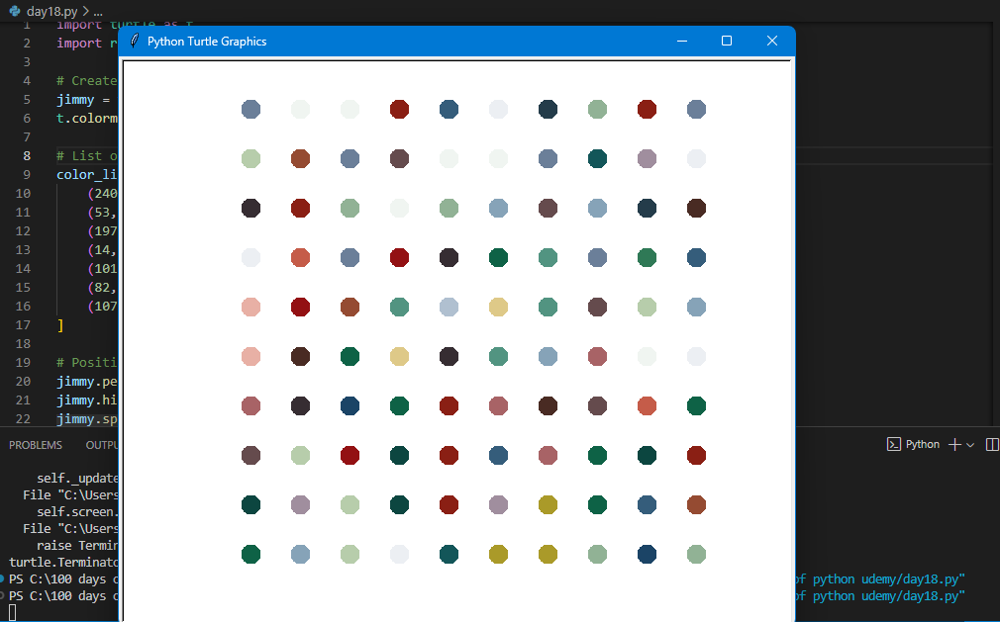

# 🎨 Day 18 – Hirst Painting Project

A fun project using the Turtle graphics module to recreate Damien Hirst’s famous dot paintings with Python.

---

## 🚀 How It Works
1. Extracts RGB color values from an image using the `colorgram` library.  
2. Creates a list of color tuples.  
3. Uses the `turtle` module to draw a 10x10 grid of colorful dots.  
4. Each dot is randomly picked from the extracted colors.  

---

## 🖼 Preview

---

## 🛠 Skills Used
- Python `turtle` graphics  
- Working with external libraries (`colorgram`)  
- For loops and nested loops  
- Random color generation  
- Image processing for color palettes  

---

## 📅 Challenge
Day 18 of the **100 Days of Python Challenge** 🐍  
🔗 [View the full repo here](https://github.com/chiragdhawan07/100-days-of-python)
