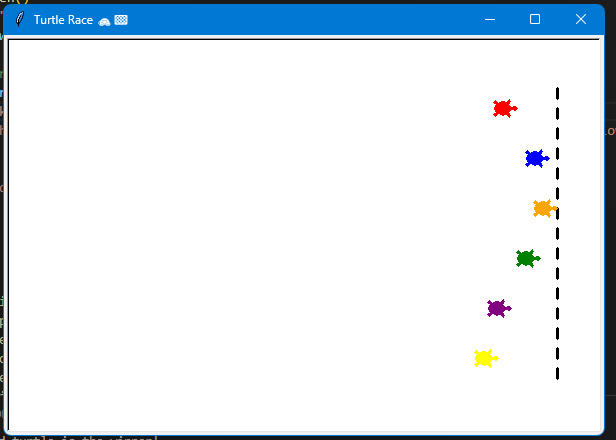

# 🐢 Day 19 – Intermediate Turtle Race Game 🏁

A fun racing game built with the **Turtle graphics module** where you bet on which turtle will win the race!

---

## 🎮 Demo

  

---

## 🚀 How It Works
1. The program sets up six turtles of different colors on the starting line.
2. The player places a bet by entering the color of the turtle they think will win.
3. A **randomized race** begins where turtles move forward by random steps.
4. A **finish line** is drawn, and the first turtle to cross it wins.
5. The program announces whether the player won or lost based on their bet.

---

## 🛠 Skills Used
- **Python Turtle Graphics** 🐢  
- **Loops & Lists** 🔄  
- **Randomization with `random`** 🎲  
- **User Input & Validation** ⌨️  
- **Basic Game Design & Visualization** 🎨  

---

## ⏱ Time Taken
⏳ Around 2–3 hours (including polish & finish line feature)

---

## 📅 Challenge
Day 19 of my **#100DaysOfPython** journey.  
👉 [View the full repository here](https://github.com/chiragdhawan07/100-days-of-python)
