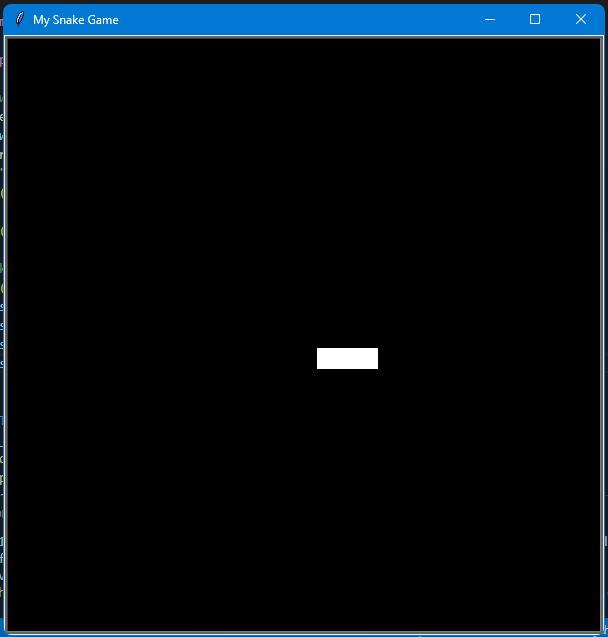

# 🐍 Day 20 – Intermediate Snake Game (Part 1: Snake Movement)

Today I started building the classic Snake Game using Python’s Turtle module.  
This is the first stage where I focused only on creating the snake and making it move with arrow key controls.  
The full game (with food, collisions, and score) will be completed in the next steps.

## 🚀 How It Works
1. A snake is created from three square segments.
2. The snake moves forward automatically in a smooth loop
3. Arrow keys (Up, Down, Left, Right) let the player control its direction.
4. At this stage, only movement is implemented — the rest will be added tomorrow.

## 🛠 Skills Used
- Object-Oriented Programming (classes & methods)
- Turtle graphics for game design
- Event listeners for keyboard controls
- Game loop with screen refresh

## 📸 Screenshot

*(Shows the snake moving inside the black game screen.)*

## 📅 Challenge
Day 20 of the 100 Days of Python challenge – [link to main repo](https://github.com/chiragdhawan07/100-days-of-python)
