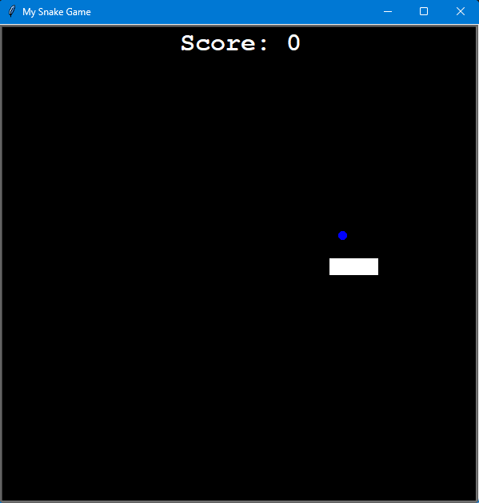
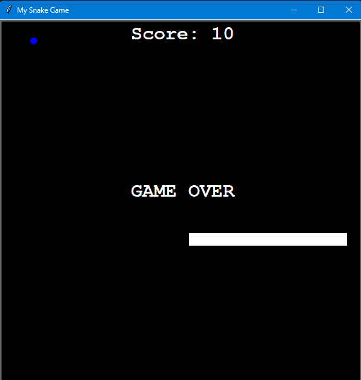

# 🐍 Day 21 – Snake Game (Intermediate)

Classic Snake Game built with Python's **turtle** graphics module.  
I improved my earlier version (Day 20) by completing the full gameplay loop:  
snake movement, food spawning, scoring, collisions, and game over screen.  

---

## 🚀 How It Works
1. The snake starts with 3 segments and moves automatically.
2. Use the **arrow keys** to control the snake's direction.
3. Eat the blue food to grow and increase your score.
4. The game ends if:
   - The snake hits a wall ❌
   - The snake collides with its own tail ❌
5. Final score is displayed when the game ends.

---

## 📸 Screenshots

  
  

---

## 🛠 Skills Used
- **Object-Oriented Programming (OOP)** in Python  
- Classes: `Snake`, `Food`, `Scoreboard`  
- Keyboard event handling with `turtle.Screen`  
- Collision detection using distance checking  
- Clean code structure with constants & reset methods  

---

**📅 Challenge**  
This is Day 21 of my 100 Days of Python challenge.  
- Day 20: Built basic snake movement  
- Day 21: Completed the full game loop 🎮

🔗 [100 Days of Python Main Repo](https://github.com/chiragdhawan07/100-days-of-python)
