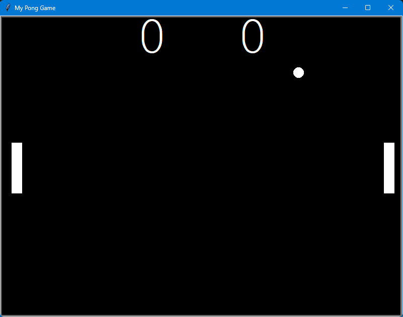
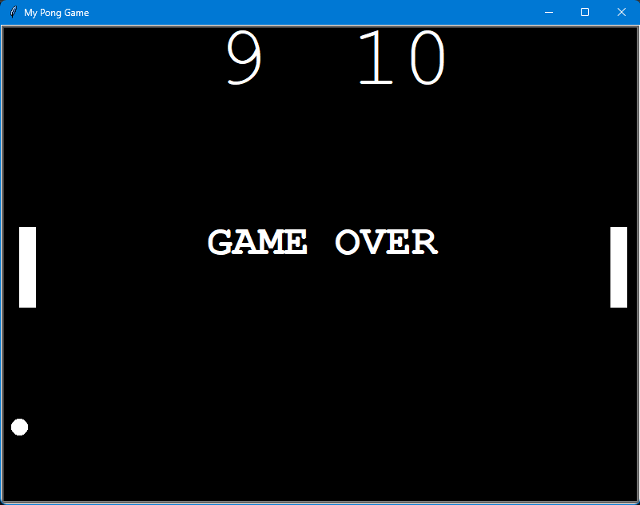

# 🏓 Day 22 – Pong Game

Classic Pong arcade game recreated with Python’s **turtle** graphics module.  
Two paddles, a bouncing ball, and a scoreboard – simple yet addictive!  

---

## 🚀 How It Works
1. **Controls:**
   - Left Paddle → `W` (up), `S` (down)  
   - Right Paddle → `↑` (up), `↓` (down)  
2. Hold the keys for continuous paddle movement.  
3. The ball bounces off the walls and paddles.  
4. Missing the ball gives a point to the opponent.  
5. First player to **10 points** wins the game.  

---

## 📸 Screenshots  

  
   
  <em>▶️ Game Start</em>

  
   
  <em>🏆 Game Over with Final Score</em>

---

## 🛠 Skills Used
- **Object-Oriented Programming (OOP)** in Python  
- Classes: `Paddle`, `Ball`, `Scoreboard`  
- Keyboard event handling with `onkeypress`  
- Collision detection (ball + paddles + walls)  
- Game loop with dynamic ball speed  
- Score tracking and display  

---

**📅 Challenge**  
This is Day 22 of my 100 Days of Python challenge.  
🔗 [100 Days of Python Main Repo](https://github.com/chiragdhawan07/100-days-of-python)
