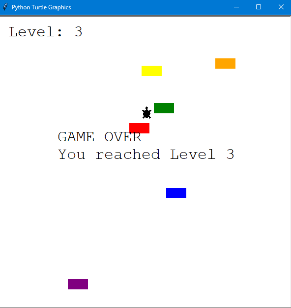

# 🐢 Day 23 – Turtle Crossing Game (Intermediate)

Arcade-style game built with Python’s **turtle graphics** module.  
Help the turtle cross the busy road while avoiding cars 🚗💨.  

---

## 🚀 How It Works
1. **Controls:**
   - Move Up → `↑` (Up Arrow Key)  
2. Cars spawn randomly and drive across the screen.  
3. Reach the top safely to **level up** – cars move faster each round.  
4. Collision with a car ends the game.  
5. The goal is to reach the **highest level possible** before getting hit!  

---

## 📸 Screenshots  

  
   
  <em>▶️ Game Start</em>

  
   
  <em>💀 Game Over with Final Level</em>

---

## 🛠 Skills Used
- **Object-Oriented Programming (OOP)** in Python  
- Classes: `Player`, `CarManager`, `Scoreboard`  
- Event handling with `onkey` for player controls  
- Game loop with car spawning & movement  
- Collision detection and object cleanup  
- Dynamic difficulty scaling with levels  

---

**📅 Challenge**  
This is Day 23 of my 100 Days of Python challenge.  
🔗 [100 Days of Python Main Repo](https://github.com/chiragdhawan07/100-days-of-python)
