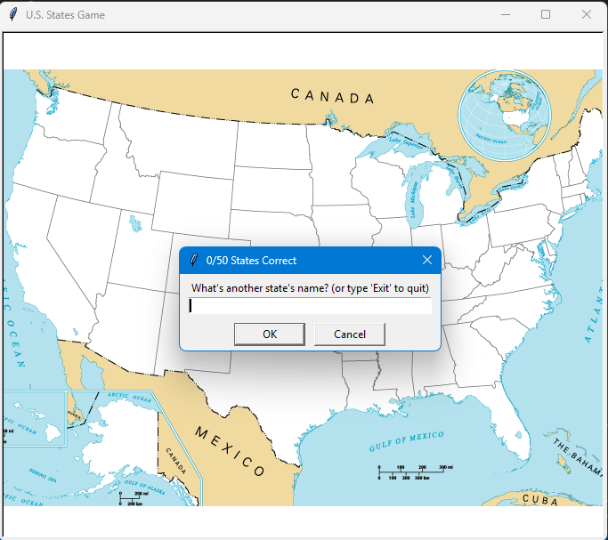

# 🗺️ Day 25 – U.S. States Game

Fun educational game built with Python's **turtle** and **pandas**.  
Guess all 50 U.S. states and watch them appear on the map!  

---

## 🚀 How It Works
1. A blank U.S. map appears on the screen.
2. The player types the name of a state.
3. If correct, the state’s name is written at its location on the map.
4. The game continues until all 50 states are guessed or the player types **Exit**.
5. When exiting, a file `states_to_learn.csv` is generated with the states you missed.

---

## 📷 Screenshot

---

## 🛠 Skills Used
- Python **turtle graphics**
- Data handling with **pandas**
- Loops, conditions, and string handling
- File generation (`states_to_learn.csv`)

---

## 📅 Challenge
This is **Day 25** of my [#100DaysOfPython](https://github.com/chiragdhawan07/100-days-of-python) challenge.  
