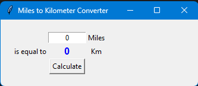

# 🔢 Day 27 – Miles to Kilometer Converter

A simple GUI app using **Tkinter** that converts distance from miles to kilometers.  
Clean interface, input validation, and instant calculation with a button click.  

---

## 🚀 How It Works
1. Enter a value in **miles** inside the input box.
2. Click the **Calculate** button.
3. The result in **kilometers** is displayed in bold blue text.
4. If you enter invalid text, it shows `"Invalid"` instead of crashing.

---

## 📸 Screenshot
Here’s how the app looks:

---

## 🛠 Skills Used
- **Tkinter** for GUI design
- **Labels, Buttons, and Entry** widgets
- **Grid Layout** for alignment
- **Error Handling** with `try/except`

---

## 📅 Challenge
This project is part of my **#100DaysOfPython** journey. 
Day 27 – *Miles to Kilometer Converter*  

👉 [Check out the full repo here](https://github.com/chiragdhawan07/100-days-of-python)
