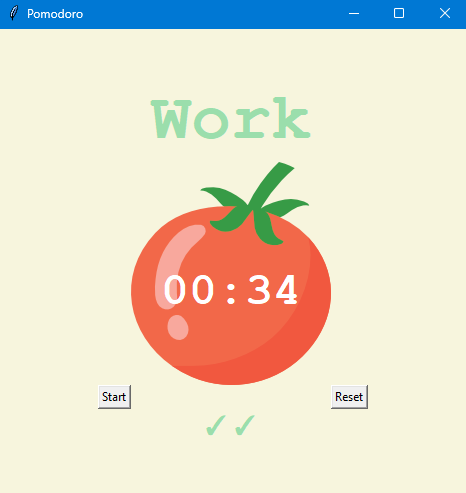
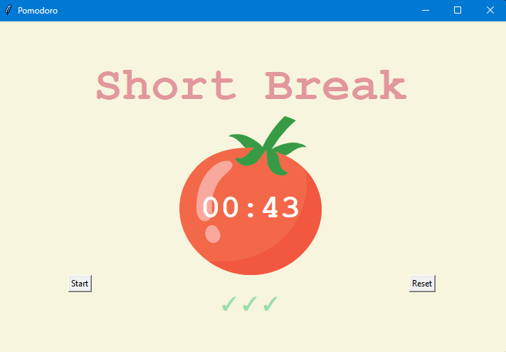

# ⏱️ Day 28 – Pomodoro Timer  

A classic **Pomodoro Timer** built with Python’s **Tkinter**.  
Stay productive by alternating focused work sessions with short and long breaks.  

---

## 🚀 How It Works  
1. Click **Start** to begin a 25-minute work session.  
2. After each work session:  
   - A **short break (5 min)** follows.  
   - After 4 work sessions, a **long break (20 min)** is triggered.  
3. ✅ Checkmarks track your completed work sessions.  
4. Use **Reset** to stop and clear the timer anytime.  

---

## 🖼️ Screenshots  

**Work Session**  
  

**Short Break**  
  

---

## 🛠 Skills Used  
- **Python** fundamentals  
- **Tkinter** for GUI design  
- Event scheduling with **`after()`**  
- String formatting with **`f"{:02d}"`**  

---

## 📅 Challenge  
Day 28 of the [#100DaysOfPython](https://github.com/chiragdhawan07/100-days)
