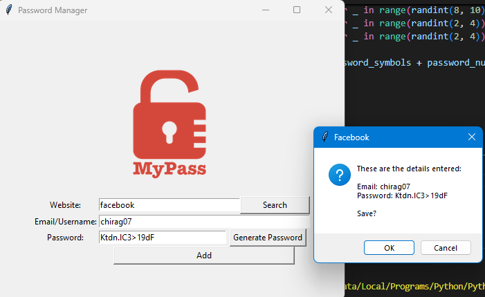
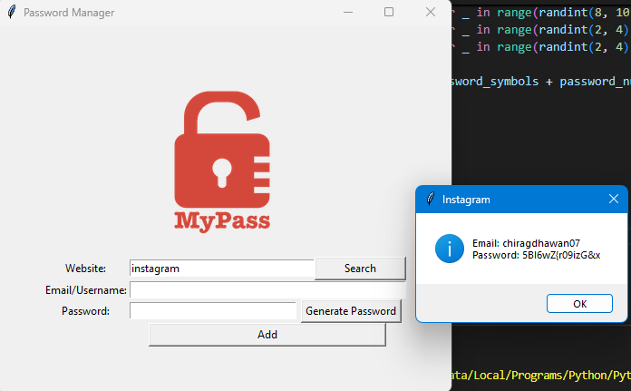

# 🔐 Day 30 – Advanced Password Manager

Upgraded password manager built with **Tkinter** that now supports **searching saved credentials**.  
Generate strong passwords, save them securely, and quickly retrieve them by website name.

---

## 🚀 Features
1. **Generate Strong Passwords** with a mix of letters, numbers, and symbols.  
2. **Save Credentials** (Website, Email/Username, Password) into a local JSON file.  
3. **Search Functionality** – Instantly look up saved credentials by website name.  
4. **Error Handling** – Prevents empty entries and handles missing data gracefully.  
5. **Case-Insensitive Storage & Search** – `Instagram`, `instagram`, or `INSTAGRAM` all match.  

---

## 🖼 Screenshots  

### Save a New Password  

### Search Saved Credentials  

---

## 🛠 Skills Used
- Python exception handling (`try/except`)  
- Tkinter GUI (Labels, Entries, Buttons, Canvas)  
- JSON file handling (read, write, update)  
- String manipulation & case normalization  

---

## 📅 Challenge
This is **Day 30** of my [#100DaysOfPython](https://github.com/chiragdhawan07/100-days-of-python) challenge.  
Building on **Day 29’s Password Manager**, this version adds a **search feature** to make it more practical and powerful.  
