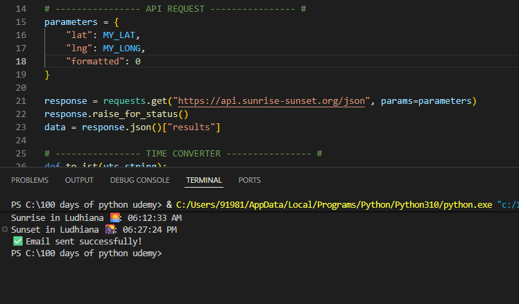
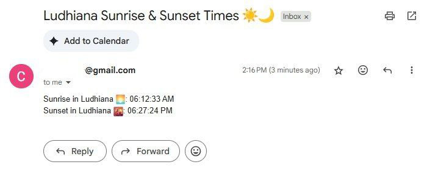

# 🌅 Day 33 – Sunrise & Sunset Email Notifier  

This project fetches **sunrise and sunset times** for Ludhiana (or any city by latitude & longitude) using the [Sunrise-Sunset API](https://sunrise-sunset.org/api).  
It then converts the times from **UTC to IST**, displays them in the terminal, and sends them as a neat **email report** using Python’s `smtplib`.  

---

## 🚀 Features  
- 🌍 Fetches real sunrise & sunset times from the API  
- 🕒 Converts UTC → IST automatically  
- 💻 Displays the results in the terminal  
- 📧 Sends an email report with the times  
- 🔑 Uses **Gmail App Passwords** for safe login  

---

## 🛠 Skills Practiced  
- Python basics & API integration (`requests`)  
- Date & time manipulation with `datetime`  
- Sending emails via `smtplib` and `MIMEText`  
- Using credentials safely with placeholders  
- Automating useful real-world tasks  

---

## 📸 Screenshots  

### ✅ Terminal Output  
  

### 📧 Email Received  
  

---

## 📅 Challenge  
This project is part of my **100 Days of Python** challenge 🎯  

👉 Day 33 of 100  
🔗 [Main Challenge Repo](https://github.com/chiragdhawan07/100-days-of-python)  
