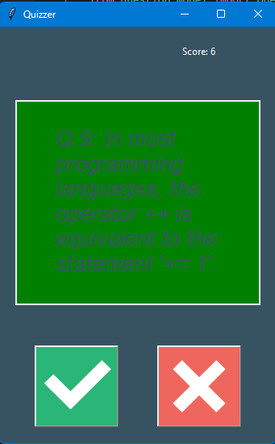
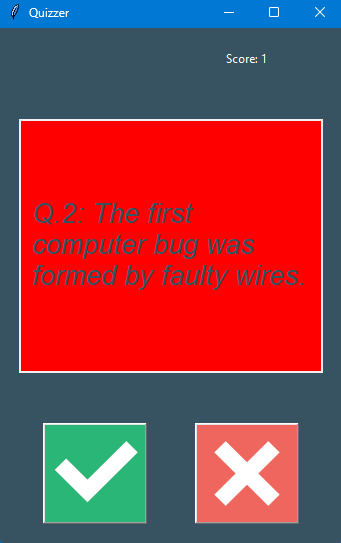

# 🧠 Day 34 – Quiz App with GUI

A true/false quiz game powered by the Open Trivia DB API, built with `tkinter` for a clean and interactive GUI.

---

## 🚀 How It Works
1. Fetches 10 True/False questions from the [Open Trivia Database](https://opentdb.com/).
2. Displays one question at a time inside the GUI.
3. Player selects **True ✅** or **False ❌**.
4. Immediate feedback is given with color highlights:
   - Green for correct
   - Red for incorrect
5. Score is tracked and displayed dynamically.
6. When all questions are answered, the final score is shown.

---

## 🖼 Screenshots
Right Answer ✅ (Green Screen)  

Wrong Answer ❌ (Red Screen)  

---

## 🛠 Skills Used
- Python OOP (classes, objects, methods)
- `tkinter` for GUI development
- `requests` for API data fetching
- Data parsing from JSON
- Quiz logic (progress tracking, scoring, validation)

---

## 📅 Challenge
This project is part of my **100 Days of Python challenge** 🎯

👉 Day 34 of 100  
🔗 [Main Challenge Repo](https://github.com/chiragdhawan07/100-days-of-python)
