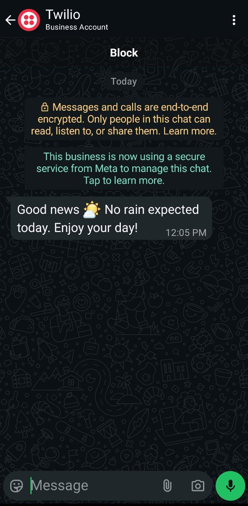
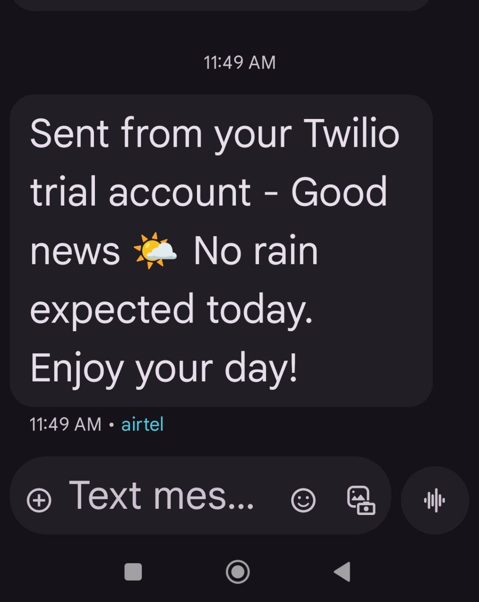

# 🌦️ Day 35 – Weather Alert with SMS & WhatsApp

A Python automation project that checks the weather forecast using **OpenWeather API** and sends an alert via **Twilio** as both **SMS and WhatsApp message**.

## 🚀 How It Works
1. Fetches 12-hour weather forecast data from OpenWeather API.
2. Checks if rain is expected (condition codes < 700).
3. If rain is predicted → sends an alert ("Bring an umbrella ☔").
4. Otherwise → sends a sunny message ("No rain expected 🌤️").
5. Alerts are delivered to your phone via:
   - 📩 SMS  
   - 💬 WhatsApp  

## 🛠 Skills Used
- Python `requests` for API calls  
- Twilio API for SMS & WhatsApp  
- Environment variables (`.env` with `python-dotenv`) for security  
- Error handling & status monitoring  

## 📸 Screenshots
### ✅ WhatsApp Alert  

### ✅ SMS Alert  

## 📅 Challenge
This project is part of my **100 Days of Python challenge** 🎯  

👉 Day 35 of 100  
🔗 [Main Challenge Repo](https://github.com/chiragdhawan07/100-days-of-python)
