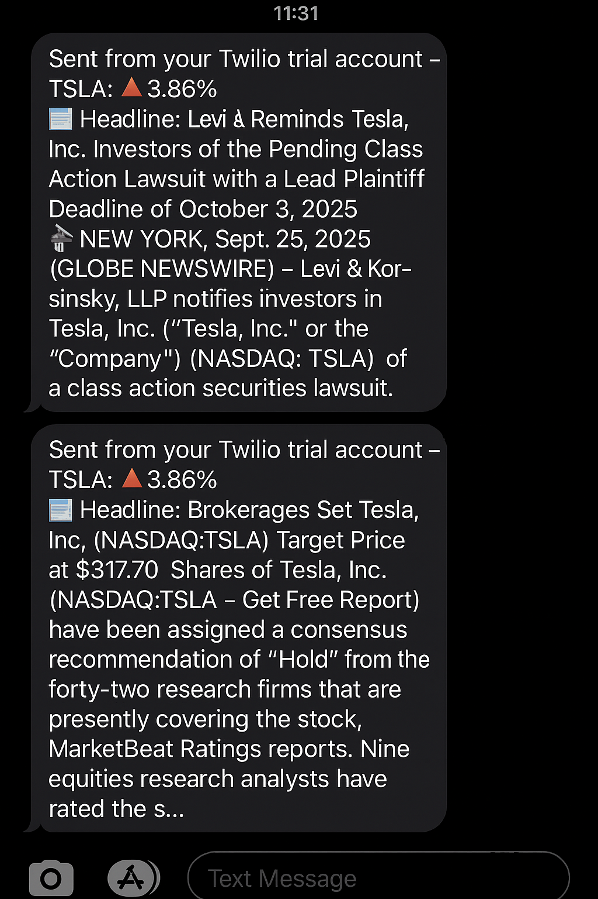
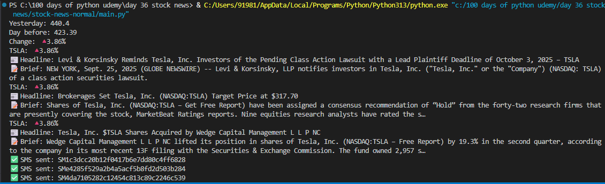

# 📈 Day 36 – Stock News SMS Alert

This project tracks Tesla stock price changes and sends **SMS alerts** with the latest news headlines using the Twilio API.

---

## 🚀 How It Works
1. Fetch daily stock prices using Alpha Vantage API.
2. Compare yesterday’s closing price with the previous day.
3. If the change is greater than 1%, fetch the latest 3 news articles about Tesla using NewsAPI.
4. Format the news and send them as SMS alerts via Twilio.

---

## 🛠 Skills Used
- API integration (Alpha Vantage, NewsAPI, Twilio)
- Environment variables with `.env`
- JSON data handling
- Error handling
- Automation with Python

---

## 📸 Demo

### 📲 SMS Output  

### 💻 Console Output  

---

## 📅 Challenge
This project is part of my **100 Days of Python challenge 🎯**

👉 Day 36 of 100  
🔗 [Main Challenge Repo](https://github.com/your-username/100DaysOfPython)
