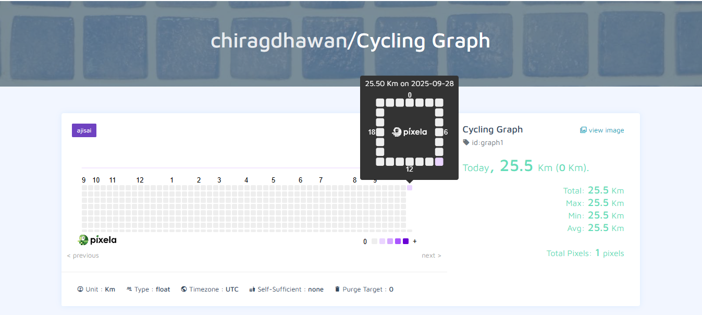

# 🚴 Day 37 – Cycling Graph with Pixela API

Track your daily cycling distance visually using the **Pixela API**.  
This project logs your activity as a pixel graph online and allows updates for any day.

---

## 🚀 How It Works
1. **Setup Graph** – Run once to create your cycling graph on Pixela.  
2. **Add Pixel** – Each day, input how many kilometers you cycled, and it logs the entry.  
3. **Update Pixel** – If needed, update the logged distance for the current day.  
4. **View Progress** – Open your Pixela graph link to see your cycling journey visually.

---

## 📷 Screenshot
Here’s my cycling graph with today’s log:  

---

## 🛠 Skills Used
- Python `requests` for API interaction  
- Working with REST APIs  
- Datetime formatting (`strftime`)  
- User input handling  
- Data visualization through external API  

---

## 📅 Challenge
This project is part of my 100 Days of Python challenge 🎯  

👉 Day 37 of 100  
🔗 [Main Challenge Repo](https://github.com/chiragdhawan/100DaysOfPython)
