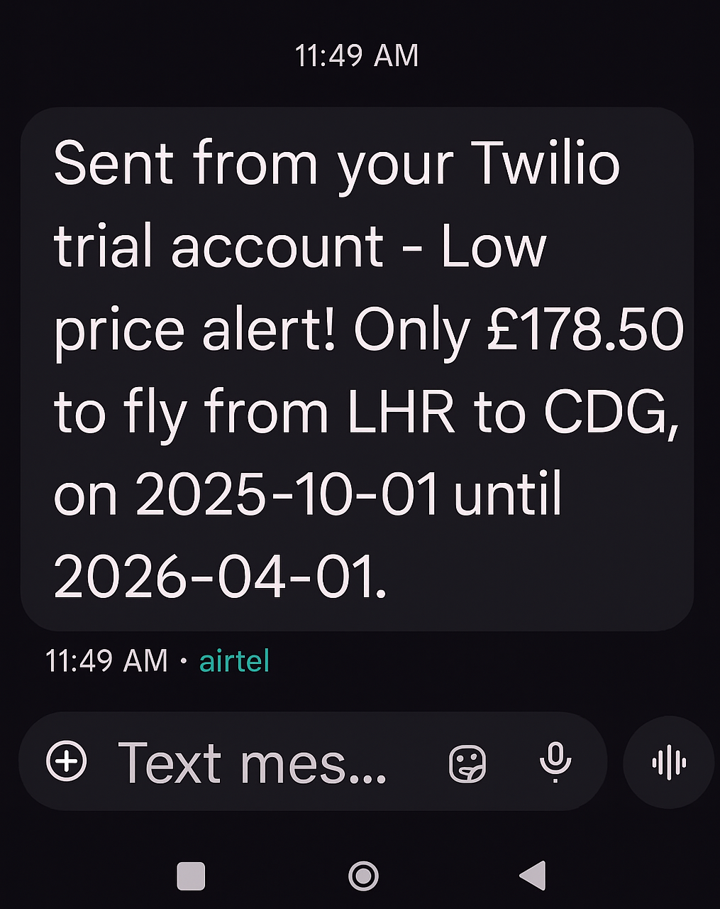

# ✈️ Day 39 – Flight Price Alert with Twilio  

Get instant notifications via **WhatsApp** and **SMS** when flight prices drop below your target!  

---

## 🚀 How It Works
1. The script checks flight prices between two cities.
2. If a deal is found under your budget, a **Twilio SMS** and **WhatsApp message** are sent.
3. You instantly receive the alert on your phone. 📱

---

## 🛠 Skills Used
- **APIs** – Flight data + Twilio
- **Python Requests** – Sending/receiving API calls
- **Environment Variables** – Secure API keys
- **Automation** – Automatic alerts for deals

---

## 📷 Screenshots  

### 📩 SMS Alert  

### 💬 WhatsApp Alert  

---

## 📅 Challenge
This project is part of my 100 Days of Python challenge🎯  

👉 Day 39 of 100  
🔗 [Main Challenge Repo](https://github.com/YOUR-USERNAME/100DaysOfPython)
