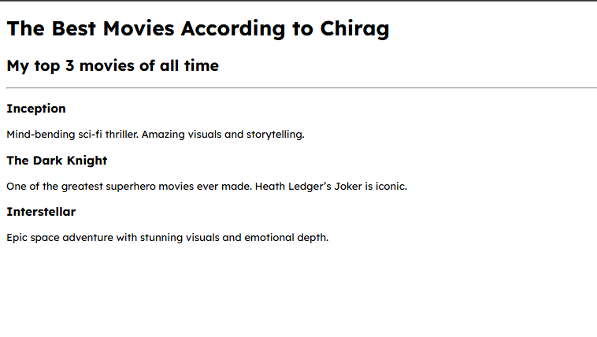

# 🎬 Day 41 – Best Movies Website

A simple HTML project that showcases my top 3 favorite movies of all time.  

## 📸 Screenshot
**Webpage Output** 

## 🚀 How It Works
1. The webpage displays a main title and a subtitle.
2. A horizontal line separates the heading from the content.
3. Each movie is shown with a title and a short description.
4. The design is minimal but clear, just using HTML tags.

## 🛠 Skills Used
- Basic HTML structure
- Headings (`h1`, `h2`, `h3`)
- Paragraphs (`p`)
- Horizontal rule (`
`)

## 📅 Challenge
This project is part of my 100 Days of Python challenge 🎯  

👉 Day 40 of 100  
🔗 [Main Challenge Repo](https://github.com/chiragdhawan07/100-days-of-python)
