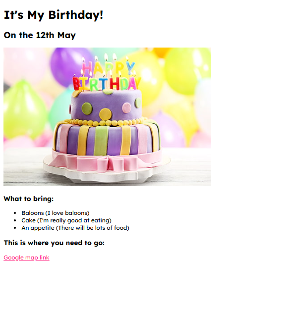

# 🎂 Day 41 – Birthday Invite Website  

A simple HTML project that creates a fun **birthday invitation webpage** with a cake image, checklist, and Google Maps location.  

---

## 🚀 How It Works  
1. Displays the **title and date** of the birthday.  
2. Shows a **birthday cake image**.  
3. Lists **what to bring** using bullet points.  
4. Provides a **Google Maps link** to the party location.  

---

## 📸 Output Screenshot  

---

## 🛠 Skills Used  
- HTML basics (`<h1>`, `<h2>`, `<ul>`, `<a>`).  
- Embedding images with ``.  
- Links with `target="_blank"`.  

---

## 📅 Challenge  
This project is part of my 100 Days of Python challenge 🎯  

👉 Day 41 of 100  
🔗 [Main Challenge Repo](https://github.com/chiragdhawan07/100-days-of-python)  
