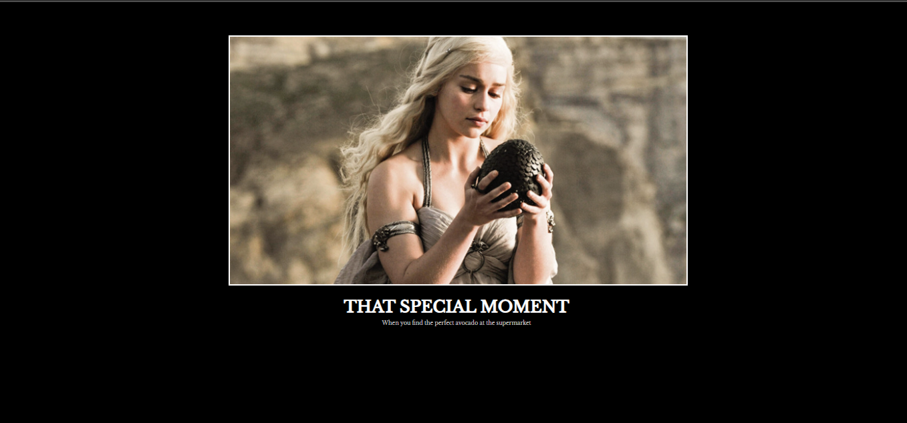

# 😂 Day 44 – Motivation Meme

A fun web project that recreates a **classic motivational meme** using simple HTML and CSS.

---

## 🚀 How It Works
1. The webpage displays an image of Daenerys holding a dragon egg.
2. Below the image, a bold uppercase title and a smaller caption mimic the classic *inspirational poster* style.
3. The layout features a **black background**, **white border**, and **centered text** — perfectly styled for a meme format.

---

## 🛠 Skills Used
- HTML5 & CSS3  
- Google Fonts integration  
- Centering elements with CSS  
- Image styling & typography

---

## 🖼 Output

---

## 📅 Challenge
Day 43 of the [#100DaysOfPython](https://github.com/chiragdhawan07/100-days-of-python) 
