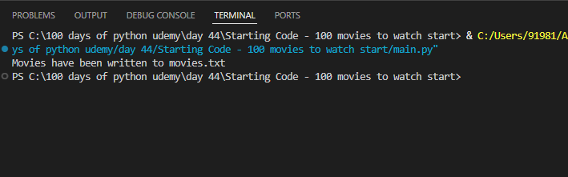
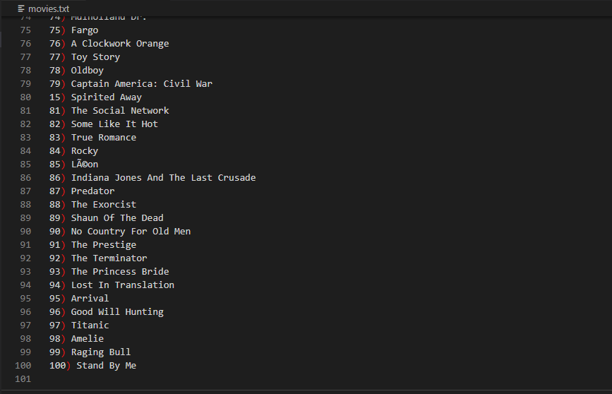

# 🎬 Day 44 – Top 100 Movies Scraper

A web scraping project that extracts the **Top 100 Movies of All Time** from an archived version of the Empire Online website and saves them into a text file.

---

## 🚀 How It Works
1. The script sends a request to the archived Empire Online page using the `requests` module.  
2. It parses the HTML using **BeautifulSoup** to find all `<h3>` tags with the class `"title"`.  
3. Extracted movie titles are reversed (since the page lists them from 100 → 1).  
4. Each title is saved line-by-line into a `movies.txt` file.  
5. The script prints a confirmation once the data is successfully written.

---

## 🛠 Skills Used
- Python `requests` for fetching web data  
- `BeautifulSoup` for HTML parsing and data extraction  
- File handling with encoding for clean text output  
- Data cleaning and list manipulation

---

## 🖼 Output Screenshots
| Terminal Output | Extracted Movies File |
|:----------------:|:--------------------:|
|  |  |

---

## 📅 Challenge
Day 44 of the **#100DaysOfPython 🐍**  
[🔗 View the Full Challenge Repository](https://github.com/chiragdhawan07/100-days-of-python)
