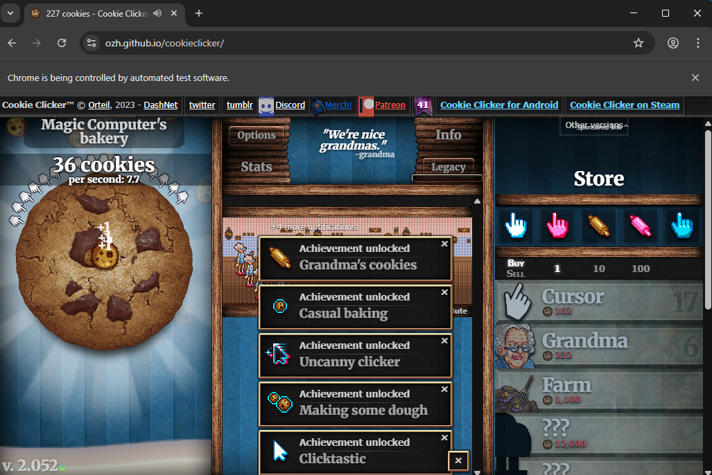
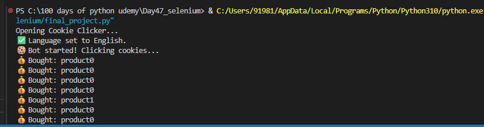

# 🍪 Day 47 – Cookie Clicker Bot

An automated bot that plays the Cookie Clicker game using Selenium — it keeps clicking cookies, buys upgrades, and optimizes your cookie production automatically!

---

## 🚀 How It Works
1. The bot opens the Cookie Clicker game in a browser.
2. Continuously clicks the main cookie to generate points.
3. Periodically checks available upgrades and purchases them.
4. Displays logs in the terminal showing which upgrades were bought.
5. Runs indefinitely to maximize cookie production efficiently.

---

## 🖼 Screenshots
### 🎮 Bot in Action

### 💻 Terminal Output

---

## 🛠 Skills Used
- **Selenium WebDriver**
- **Browser Automation**
- **Web Element Interaction**
- **Dynamic Web Handling (XPath/CSS Selectors)**
- **Automation Logic & Timers**

---

## 📅 Challenge
Day 47 of the **#100DaysOfPython** challenge  
🔗 [GitHub Repository](https://github.com/chiragdhawan07/100-days-of-python)
