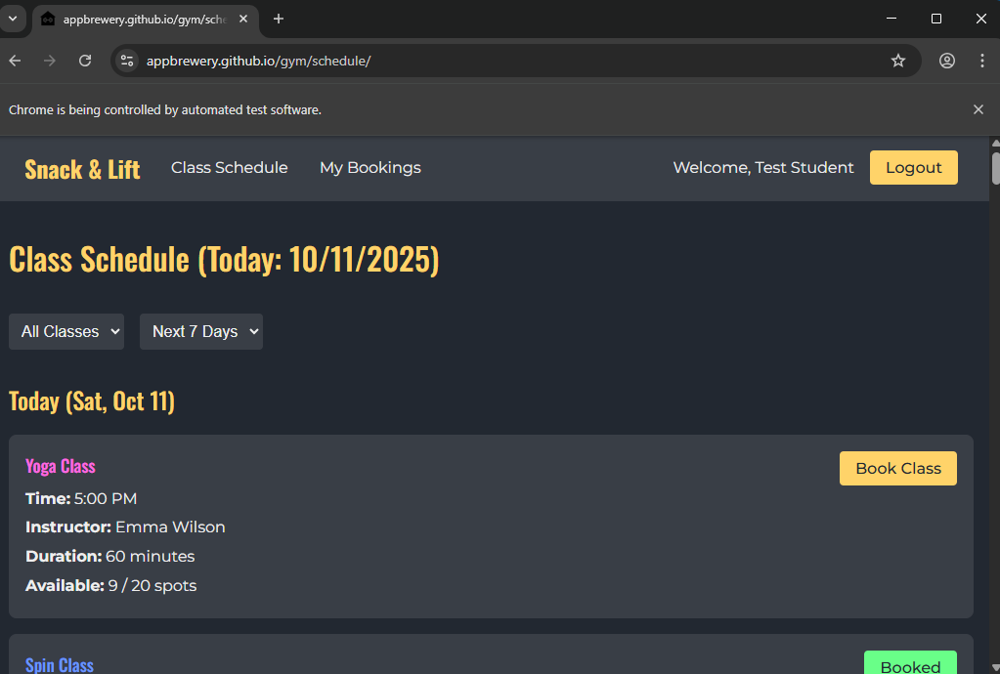
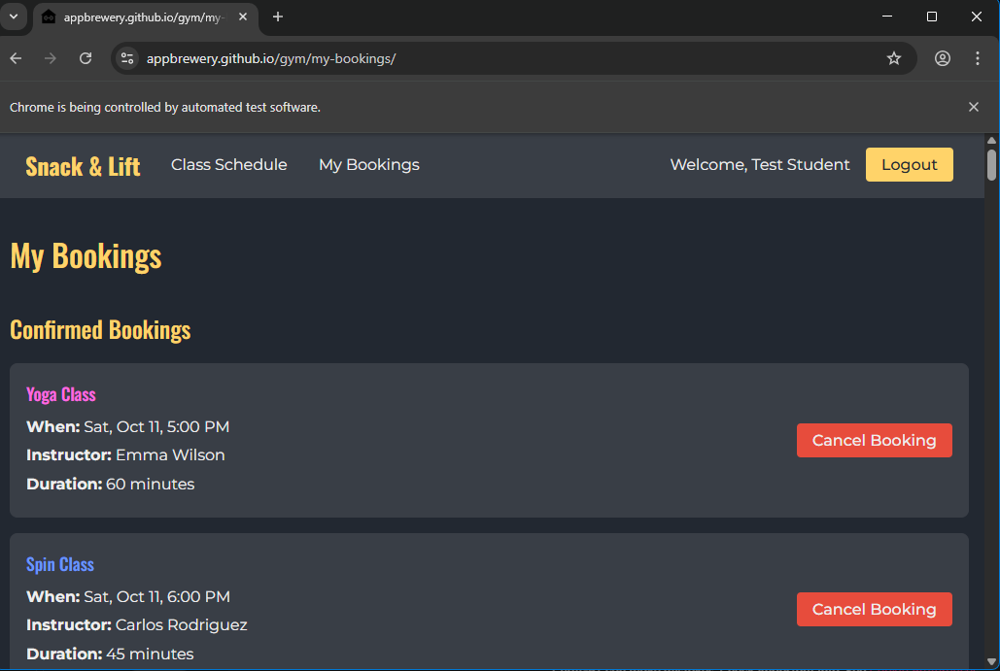

# 🏋️ Day 48 – Gym Auto Booker

An automated Selenium bot that logs into a demo gym booking website, books specific classes, and verifies them under **My Bookings** — all hands-free!

---

## 🚀 How It Works
1. Opens the **Snack & Lift Gym** demo site using Chrome automation.  
2. Logs in using preset credentials.  
3. Scans all available classes on the schedule page.  
4. Automatically books or waitlists **Tuesday/Thursday 6PM** sessions.  
5. Verifies booked classes under the **My Bookings** page.  

---

## 🛠 Skills Used
- Python 🐍  
- Selenium WebDriver  
- Explicit Waits & Retry Logic  
- Automated Browser Control  
- DOM Navigation (CSS & XPath)  
- Exception Handling  

---

## 📸 Output Screenshots
| Login Page | My Bookings |
|-------------|-------------|
|  |  |

---

## 📅 Challenge
Day 48 of [#100DaysOfPython 🐍](https://github.com/chiragdhawan07/100-days-of-python)

---

💡 *A fully automated, human-style Selenium workflow for web testing and booking systems.*
