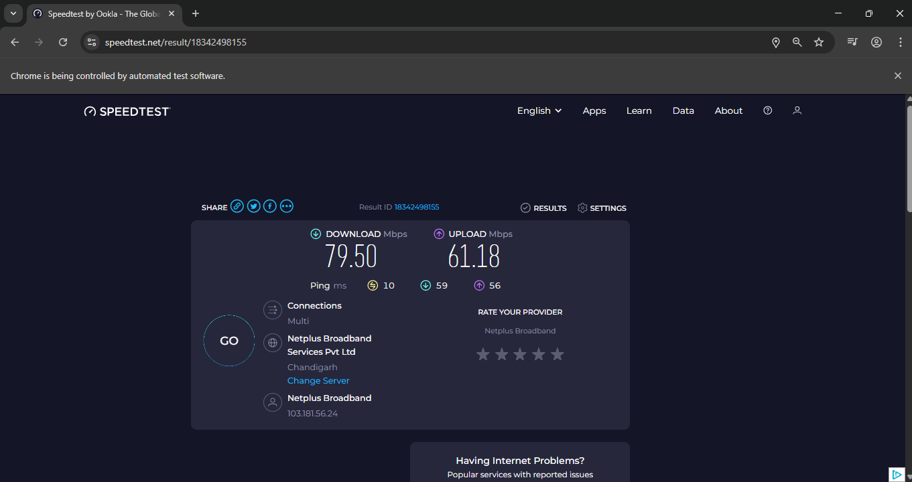

# 🚀 Day 50 – Internet Speed Twitter Bot

An automation bot that checks your internet speed using **Speedtest.net** and automatically tweets at your provider if the speed is slower than promised. Built with Selenium WebDriver.

---

## ⚙️ How It Works

1. Opens [speedtest.net](https://www.speedtest.net/) and starts the internet speed test.
2. Waits for the test to complete and records download/upload speeds.
3. Logs into Twitter automatically.
4. Posts a complaint tweet tagging your ISP with the real vs promised speeds.

---

## 🛠 Skills Used

- Python 🐍  
- Selenium WebDriver  
- Web Automation  
- Dynamic Element Handling with `WebDriverWait`  
- Exception Handling and Automation Flow Control  

---

## 📸 Output

### 🧪 Speed Test Result

### 🐦 Auto Tweet

---

## 📅 Challenge
**Day 50** of my [#100DaysOfPython](https://github.com/chiragdhawan07/100-days-of-python) journey.

---

💡 *“Automation is not about replacing humans, it’s about freeing them for higher thinking.”*
