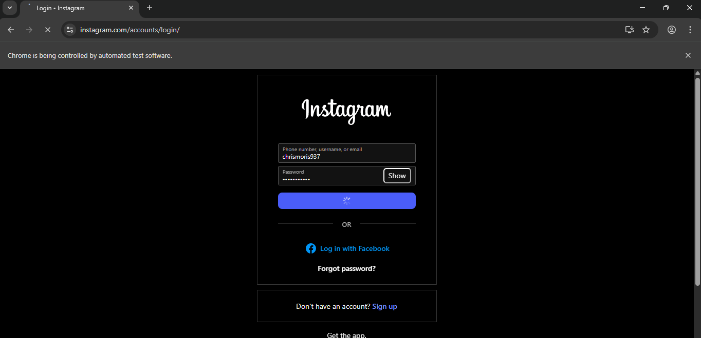
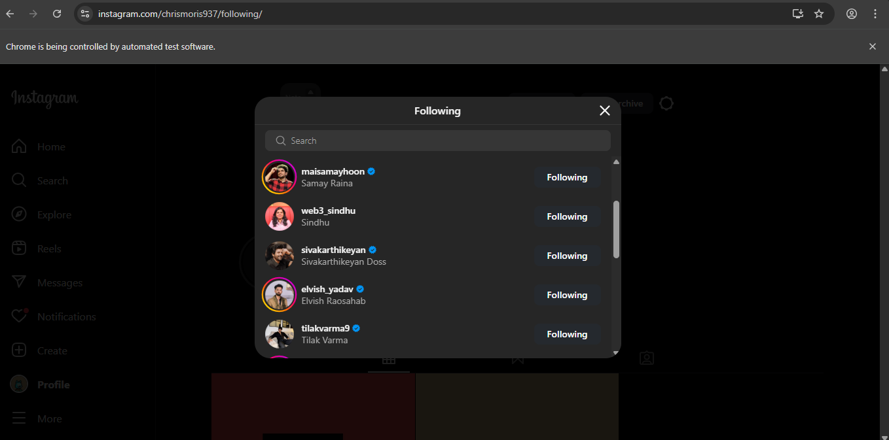
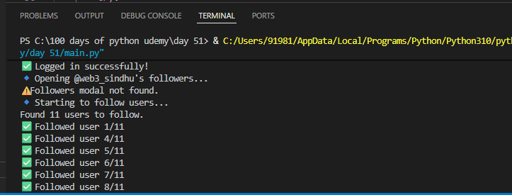

# 📸 Day 51 – Instagram Follower Bot

An automation bot that logs into Instagram, visits a target account, and extracts its followers list automatically using Selenium.

---

## 🚀 How It Works
1. Loads login credentials securely from a `.env` file.
2. Launches Chrome using Selenium WebDriver.
3. Logs into Instagram using your username & password.
4. Searches for the target account (defined in `.env` as `SIMILAR_ACCOUNT`).
5. Opens its followers list and scrolls to load all entries.
6. Extracts and prints all follower usernames in the terminal.

---

## 🖼 Screenshots
| Login Page | Followers List | Terminal Output |
|-------------|----------------|----------------|
|  |  |  |

---

## 🛠 Skills Used
- Selenium WebDriver Automation  
- Environment Variable Handling (`python-dotenv`)  
- Dynamic Page Scrolling  
- XPath & Element Locators  

---

## 📅 Challenge
**Day 51** of [#100DaysOfPython 🐍 Challenge](https://github.com/chiragdhawan07/100-days-of-python)  
Project: **Instagram Follower Bot**

---
