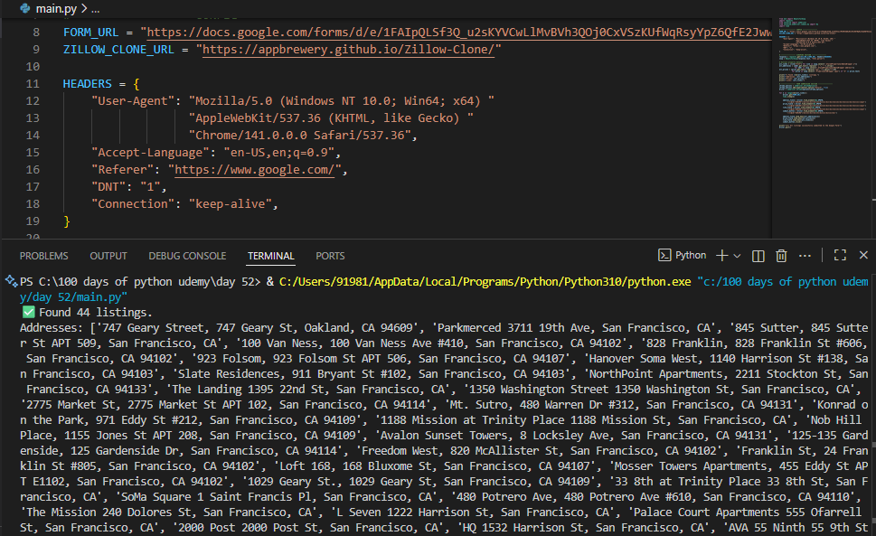
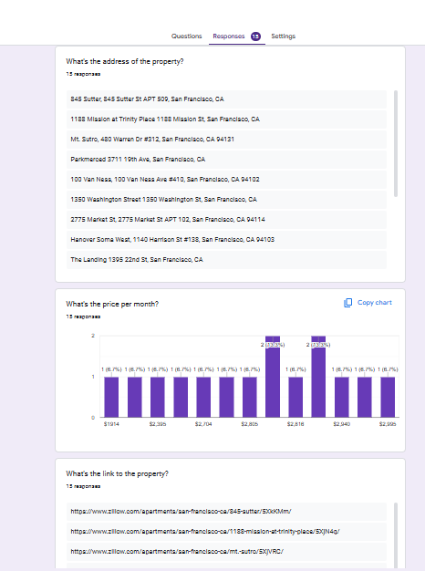

# 🏡 Day 52 – Apartment Price Analyzer  

A Python automation script that scrapes apartment listings, extracts rent details, and automatically fills them into a Google Form for analysis.  

---

## 🚀 How It Works  
1. **Scrapes Data:** Collects apartment addresses, prices, and links from a Zillow clone website using BeautifulSoup and Requests.  
2. **Cleans Data:** Removes extra text, whitespace, and unwanted symbols for neat output.  
3. **Automates Form Filling:** Uses Selenium to auto-fill each property’s details into a Google Form.  
4. **Visualizes Results:** The Google Form automatically summarizes submitted data as charts and analytics.  

---

## 🛠 Skills Used  
- Python (Requests, BeautifulSoup, Selenium)  
- Web Scraping & Browser Automation  
- Data Cleaning & Parsing  
- Google Forms Integration  
- Real Estate Data Analysis  

---

## 📸 Screenshots  

**✅ Script Running Successfully**  

  

  

**📊 Google Form Responses**  

  

  

---

## 📅 Challenge  
Day 52 of [#100DaysOfPython 🐍](https://github.com/chiragdhawan07/100-days-of-python)
