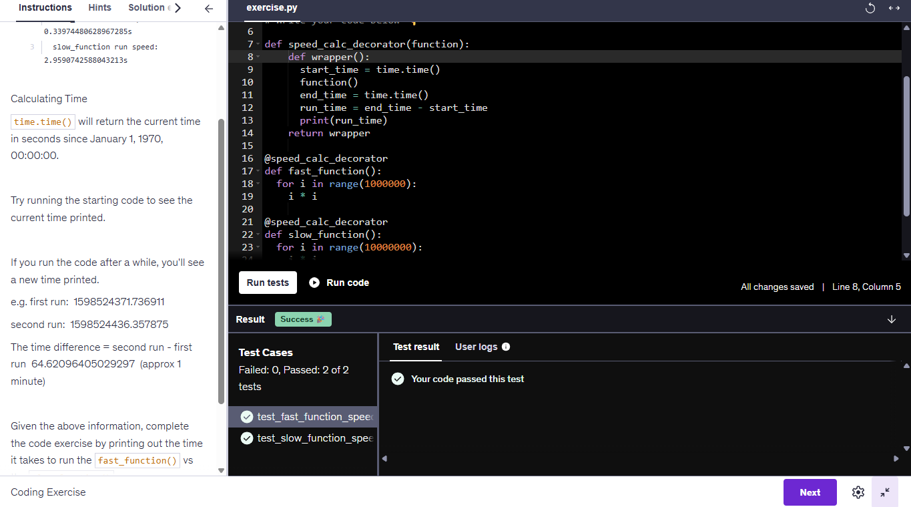
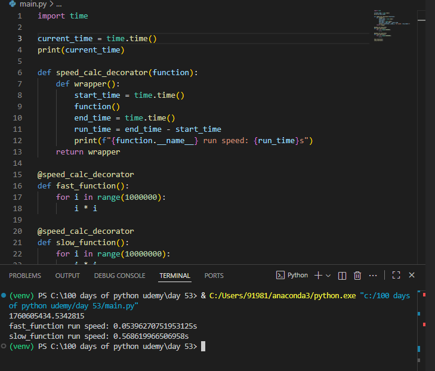

# ⚡ Day 53 – Function Speed Calculator

A Python decorator that measures how long a function takes to execute — perfect for understanding how decorators work in Python and how to profile function performance.

---

## 🚀 How It Works
1. `speed_calc_decorator()` records the start time before running the function.  
2. After the function executes, it records the end time.  
3. It calculates the total run duration and prints it in seconds.  
4. The decorator is applied to both `fast_function()` and `slow_function()`.

---

## 🛠 Skills Used
- Python Decorators  
- Function Wrapping  
- Performance Measurement using `time.time()`

---

## 🖼 Output Screenshots

  
  &nbsp;&nbsp;&nbsp;&nbsp;
  

---

## 📅 Challenge
Part of **Day 53** of my [#100DaysOfPython](https://github.com/chiragdhawan07/100-days-of-python) challenge.
