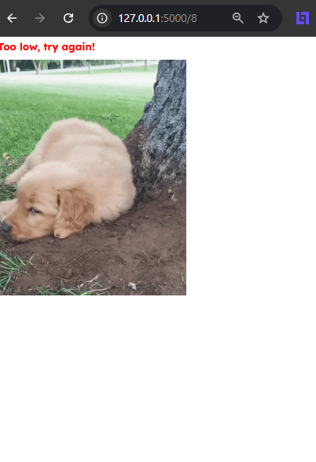
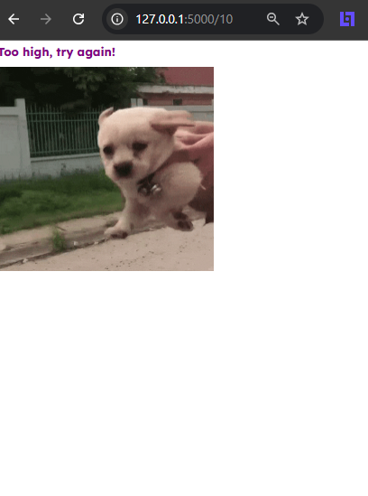

# 🪄 Day 54 – Advanced Decorators

A Python project demonstrating how to build a custom **logging decorator** that tracks which function is called, what arguments are passed, and what value is returned — all without modifying the original function.

---

## 🚀 How It Works

1. The `logging_decorator()` wraps any function.
2. When the wrapped function is called:
   - It prints the function name.
   - Logs the arguments passed.
   - Displays the returned value.
3. Demonstrated on a sample function `a_function(1, 2, 3)` returning the sum.

---

## 🧩 Example Outputs

### Too Low Guess

### Too High Guess

### Correct Answer

---

## 🛠 Skills Used

- `*args` unpacking
- Function decorators
- Logging function calls
- Function introspection

---

## 📅 Challenge

Day 54 of the **#100DaysOfPython** challenge  
🔗 [GitHub Repository](https://github.com/chiragdhawan07/100-days-of-python)
