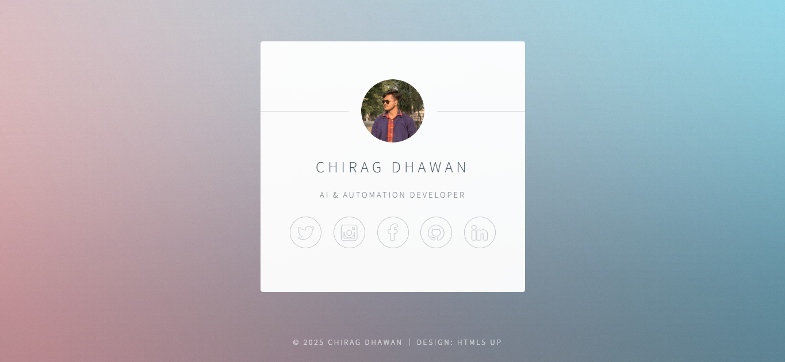

# 💼 Day 55 – Personal Name Card Website

A minimal **HTML-based digital name card** that showcases my identity, profession, and social links in a clean, professional layout. Built using the **HTML5UP Identity Template**, customized with my own design and information.

---

## 🚀 How It Works
1. The main page (`index.html`) displays your name, role, and profile image.
2. Social media icons link directly to your professional profiles.
3. Simple styling from the HTML5UP template gives a modern, card-like look.
4. `main.py` can be used to serve the HTML page locally (Flask-based setup).

---

## 🛠 Skills Used
- **HTML5 & CSS3** for layout and styling  
- **Flask (Python)** for serving the page  
- **Template editing** & static file management  
- **Version control** with GitHub  

---

## 🧠 Highlights
- Lightweight and beginner-friendly design  
- Custom profile integration  
- Credits given to original HTML5UP template  
- Clean and professional showcase for GitHub  

---

## 🖼 Preview

---

## ⚙️ Note
This project uses the **HTML5UP Identity Template**.  
To keep the repository lightweight, only essential files are included.  
You can find the full template here: [https://html5up.net/identity](https://html5up.net/identity)

---

## 📅 Challenge
Part of my **#100DaysOfPython** journey —  
**Day 55: Name Card Website**

🔗 [GitHub Repo](https://github.com/chiragdhawan07/100-days-of-python)

---

⭐ *A clean digital identity is the first step toward a professional presence.*
