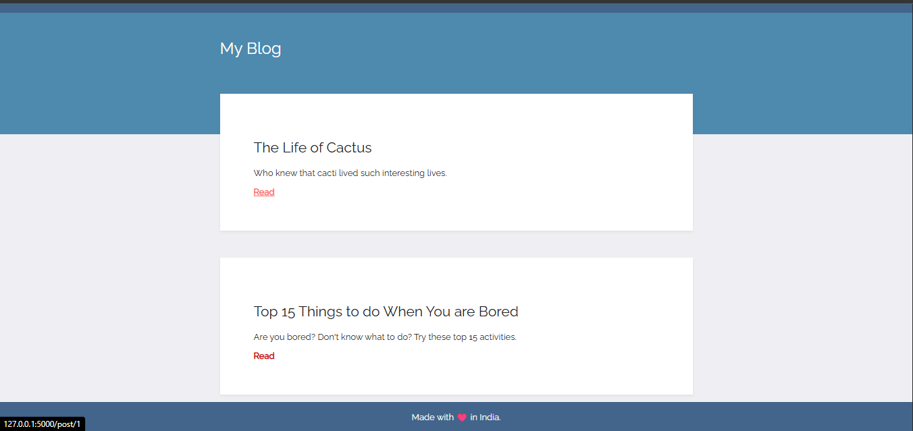
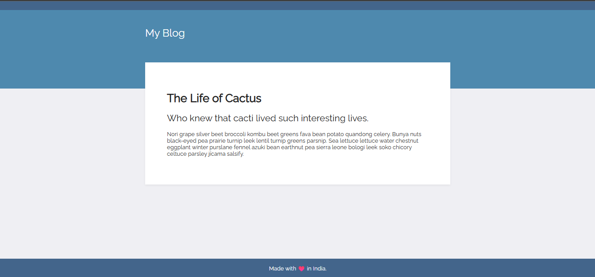

# 📰 Day 56–57 – Flask Blog Templating

A simple blog website built using **Flask**, where posts are dynamically rendered using Jinja templating. The project demonstrates how to separate backend logic and frontend design efficiently with HTML, CSS, and Flask templates.

---

## 🚀 How It Works
1. `main.py` runs a Flask app serving two pages — the homepage and individual post pages.
2. The homepage (`index.html`) lists all available blog posts with titles and subtitles.
3. Clicking **Read** opens the post in a new page (`post.html`), displaying the full content.
4. Styling is handled using an external CSS file under `/static/css/styles.css`.

---

## 🖼️ Output Screenshots

### 🏠 Home Page

### 📄 Post Page

---

## 🛠 Skills Used
- Python 🐍  
- Flask (Routing, Rendering Templates)  
- Jinja2 Templating  
- HTML & CSS (Frontend Design)

---

## 📅 Challenge
This project combines **Day 56 & 57** of the [100 Days of Python Challenge](https://github.com/chiragdhawan07/100-days-of-python).

---

**💡 Made with ❤️ using Flask**
