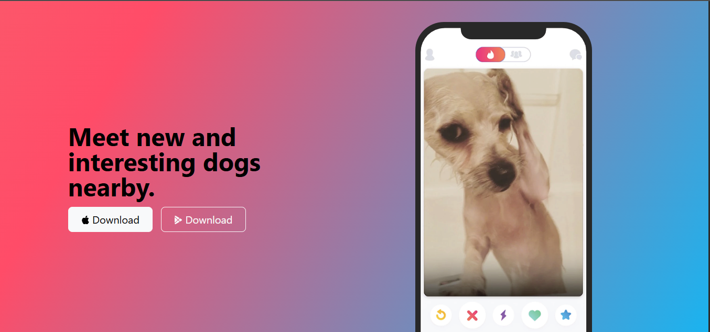
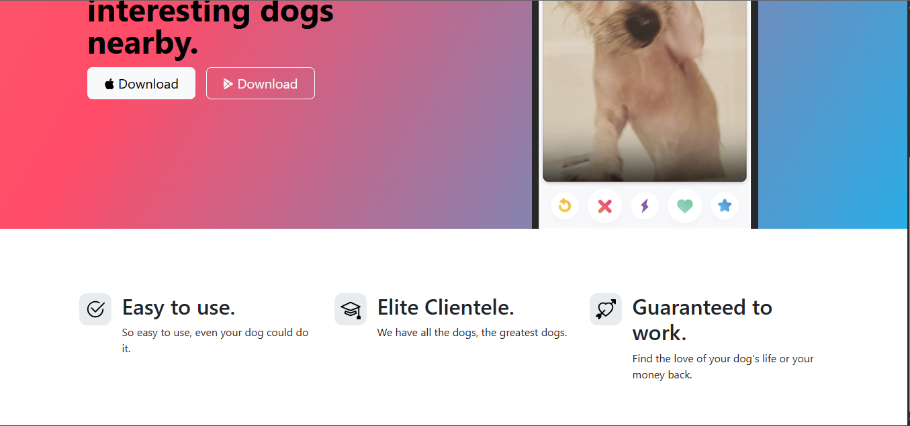

# 🐶 Day 58 (Part 1) – TinDog Website

A responsive landing page for **TinDog**, a fun concept website like Tinder but for dogs 🐾.  
This part covers the **Title and Features** sections built using HTML + Bootstrap 5.

---

## 🚀 How It Works
1. Built with **Bootstrap grid system** for perfect responsiveness.  
2. The **title section** displays an app-style layout with gradient background and download buttons.  
3. The **features section** highlights key advantages with Bootstrap icons.  
4. Organized semantic sections for easy expansion (Testimonial, Pricing, Footer coming in Part 2).

---

## 🛠 Skills Used
- HTML5 & CSS3  
- Bootstrap 5 Components  
- Responsive Grid & Utility Classes  
- SVG Icons Integration  
- Gradient Background Styling  

---

## 📸 Output Preview
| Screenshot 1 | Screenshot 2 |
|:-------------:|:-------------:|
|  |  |

---

## 📅 Challenge
**Day 58 (Part 1)** of my [#100DaysOfPython 🐍 Challenge](https://github.com/chiragdhawan07/100-days-of-python)  
Tomorrow I’ll complete **Part 2** adding testimonials, pricing, and footer sections.
