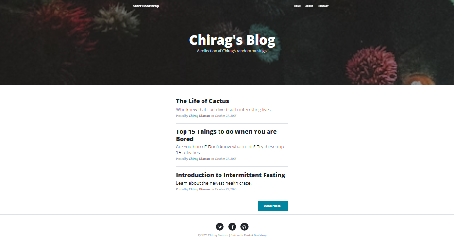
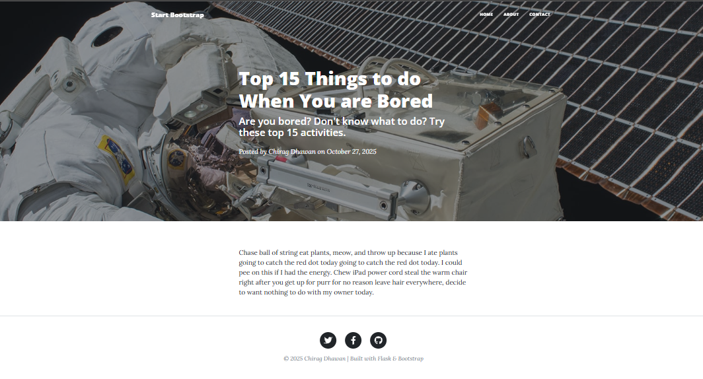
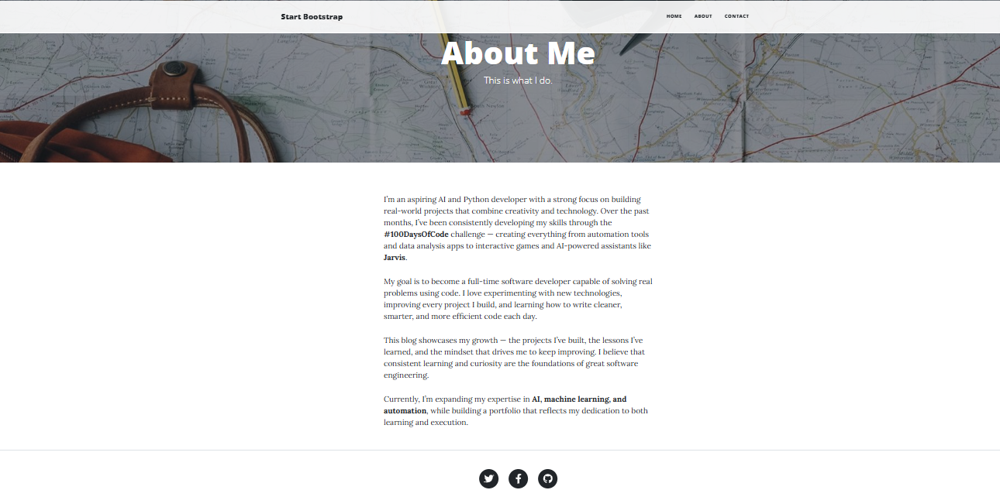
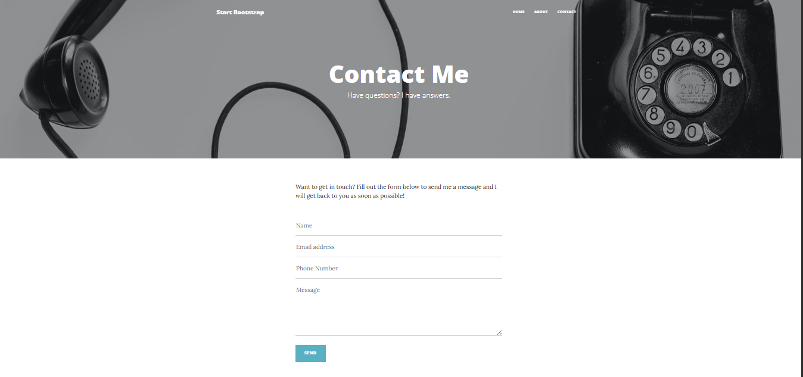

# 📝 Day 59 – Flask Blog Website

A dynamic blog website built using **Flask** and **Bootstrap**, featuring an elegant UI, individual post pages, and API-based post loading.  
This project demonstrates backend templating with Jinja, clean routing, and modern front-end design.

---

## 🚀 How It Works

1. The Flask backend fetches all blog posts from an external API using `requests`.
2. The homepage dynamically displays post titles, subtitles, and authors.
3. Clicking a post redirects to its detailed page with full content.
4. Separate **About** and **Contact** pages are included for a complete blog experience.
5. Templates are modular — with shared header and footer for maintainability.

---

## 🛠 Skills Used

- 🐍 **Python (Flask Framework)**
- 🧩 **Jinja2 Templating**
- 🌐 **HTML5, CSS3, Bootstrap 5**
- 🔗 **REST API Integration**
- 🧱 **File & Template Structuring**
- ⚙️ **Dynamic Rendering with Flask Routing**

---

## 🖼️ Project Preview

### 🏠 Home Page  

  

### 📰 Post Page 

  

### 👤 About Page  

  

### ✉️ Contact Page  

  

---

## 📅 Challenge

Part of **Day 59** of my [#100DaysOfPython](https://github.com/chiragdhawan07/100-days-of-python) challenge — building real-world projects daily to master Python and Flask development.

---

⭐ **A clean, responsive Flask blog website built for portfolio and recruiter-ready demonstration.**

