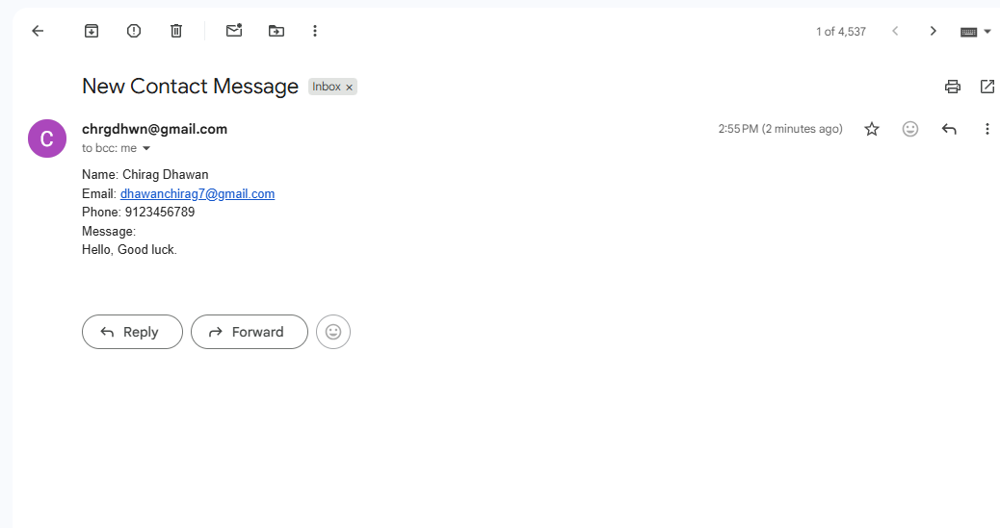

# 💌 Day 60 – Blog Website Contact Feature

Enhanced my Flask Blog Website by adding a fully functional **Contact Me** form that sends user messages directly to my email.

---

## 🚀 How It Works
1. User fills out the **Contact Form** on the website.
2. The form data (Name, Email, Phone, Message) is submitted via POST request.
3. Flask handles the backend logic and sends the message to my Gmail using `smtplib`.
4. User sees a **"Message Sent Successfully ✅"** confirmation screen.
5. The mail is received instantly with all entered details.

---

## 🖼 Screenshots
| Contact Form | Message Sent | Email Received |
|:-------------:|:------------:|:---------------:|
|  |  |  |

---

## 🛠 Skills Used
- **Flask** for backend routing  
- **HTML + Bootstrap** for frontend design  
- **smtplib** for sending emails  
- **Jinja2 Templates** for dynamic rendering  
- **Python Environment Variables** for secure credentials

---

## 📅 Challenge
This is **Day 60** of my [#100DaysOfPython Challenge](https://github.com/chiragdhawan07/100-days-of-python).  
Continuing from **Day 59 Blog Website**, this update adds real-world functionality with email integration.
