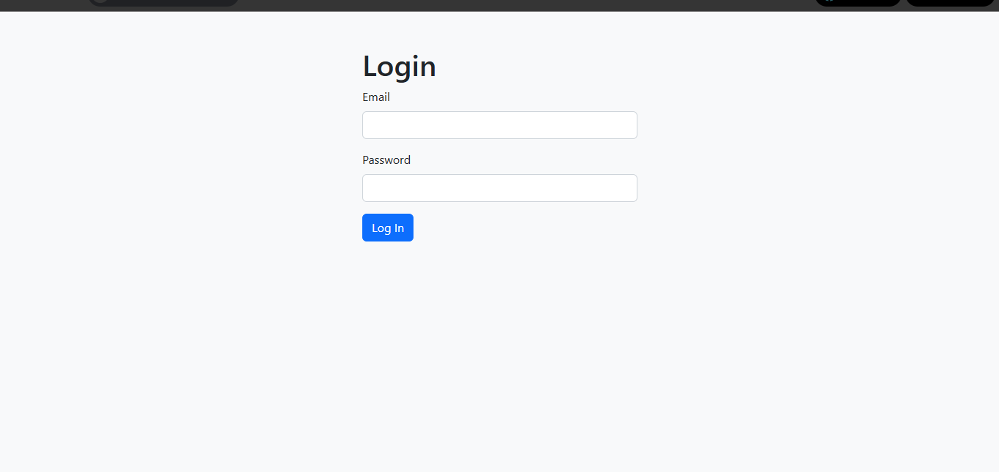

# 🔐 Day 61 – Flask Login Page

A simple Flask web app featuring a secure login system with Flask-WTF and Bootstrap integration.

---

## 🚀 How It Works
1. The user enters email and password on the login page.
2. Flask-WTF validates the input fields.
3. If credentials match, the user is redirected to a top-secret page.
4. If login fails, access is denied with an error message.

---

## 🖼 Output Screenshots

### 🧾 Login Page

### ✅ Access Granted

---

## 🛠 Skills Used
- Flask & Flask-WTF
- Bootstrap 5 integration
- Jinja templating
- Python form validation

---

## 📅 Challenge
Day 61 of [#100DaysOfPython 🐍](https://github.com/chiragdhawan07/100-days-of-python)
