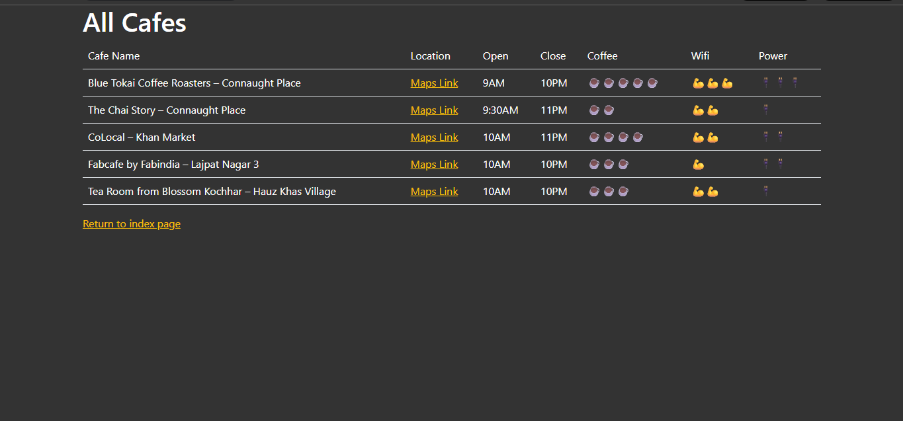
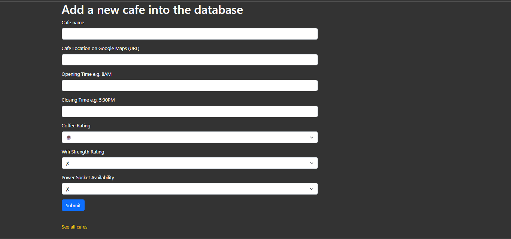
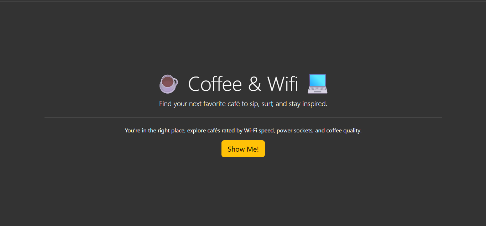

# ☕ Day 62 – Coffee & Wifi 💻  
A stylish Flask web app to explore and rate cafés based on coffee quality, Wi-Fi strength, and power socket availability.  
Ideal for freelancers, students, or anyone who loves working with a good cup of coffee!

---

## 🚀 How It Works  
1. Open the app to explore a curated list of cafés with real ratings.  
2. View café details including **Wi-Fi strength**, **coffee quality**, and **power socket access**.  
3. Use the **Add Café** form to contribute new spots easily.  
4. All entries are stored in a simple **CSV file** and displayed dynamically on the cafés page.  

---

## 🛠 Skills Used  
- **Flask** – for backend routing & templates  
- **Flask-WTF** – for forms and validation  
- **Bootstrap 5** – for modern UI styling  
- **CSV** – for lightweight data storage  
- **Jinja2** – for dynamic HTML rendering  

---

## 🖼 Screenshots  

### ☕ All Cafés  
Explore the full list of cafés with details on timings, Wi-Fi, power sockets, and coffee quality.  

---

### ➕ Add a New Café  
Submit your favorite café to the database with emoji ratings for each category.  

---

### 🏠 Home Page  
The entry point of the app with a clean, minimal landing screen.  

---

## 📅 Challenge  
Day 62 of the [#100DaysOfPython](https://github.com/chiragdhawan07/100-days-of-python) challenge 🚀  
Explore all my daily Python projects on GitHub!
