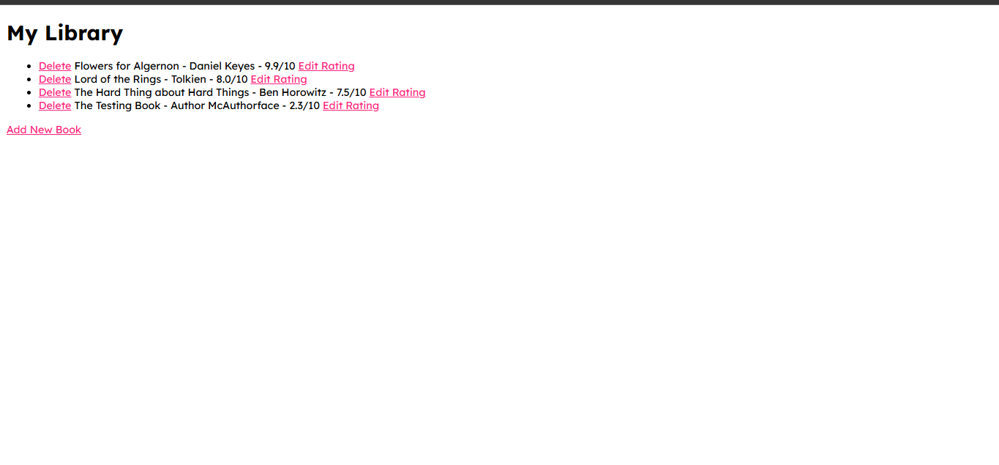
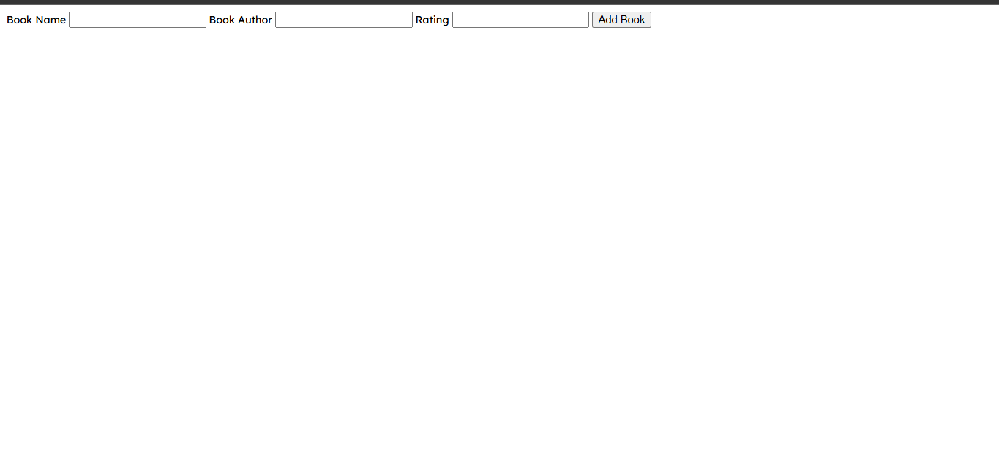
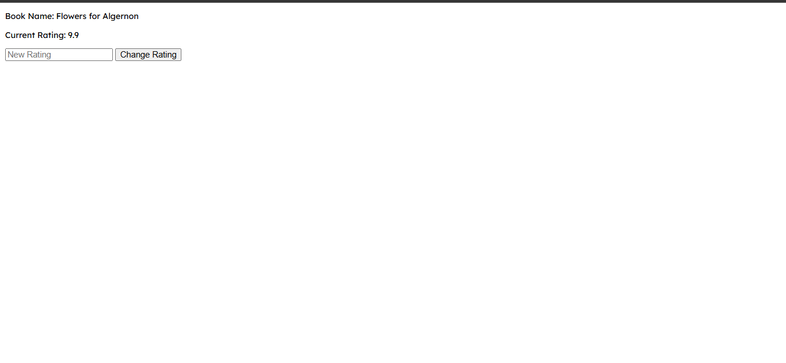

# 📚 Day 63 – Book Library Web App

A simple Flask web app to manage your personal book collection.  
You can **add new books, edit their ratings, and delete entries** — all stored neatly in a SQLite database.

---

## 🚀 How It Works
1. The **homepage** displays your complete library list.  
2. Click **“Add New Book”** to insert a new book with title, author, and rating.  
3. Use **“Edit Rating”** to update a book’s score.  
4. Hit **“Delete”** to remove a book from the collection.  
5. All data updates instantly in the SQLite database.

---

## 🛠 Skills Used
- Flask Web Framework  
- Jinja2 Templates  
- HTML & Basic Styling  
- SQLite Database  
- CRUD (Create, Read, Update, Delete) Operations  

---

## 📸 Screenshots
| Home Page | Add Book | Edit Rating |
|------------|-----------|-------------|
|  |  |  |

---

## 📅 Challenge
**Day 63 of the [#100DaysOfPython Challenge](https://github.com/chiragdhawan07/100-days-of-python)** 💯
