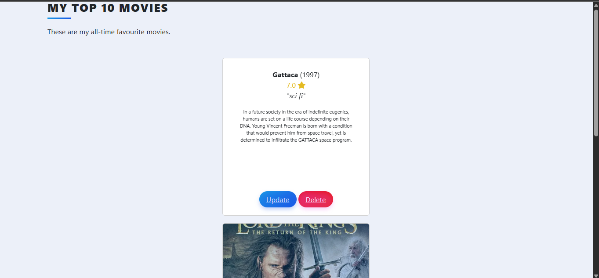

# 🎬 Day 64 – Movie Database

A Flask web app to manage your favorite movies — add, edit ratings & reviews, and view a ranked movie list powered by SQLAlchemy and The Movie Database (TMDB) API.

---

## 🚀 How It Works
1. **Home Page:** Displays your movie collection ranked by rating.  
2. **Add Movie:** Search for a movie title using the TMDB API.  
3. **Select Movie:** Choose from the API results to add it to your database.  
4. **Edit Page:** Update the movie’s rating and review.  
5. **Delete Movie:** Remove any movie from your list instantly.  
6. **Dynamic Ranking:** Automatically updates rankings based on ratings.

---

## 🛠 Skills Used
- Flask  
- SQLAlchemy  
- WTForms  
- Bootstrap 5  
- TMDB API Integration  
- Jinja2 Templates  
- CRUD Operations with SQLite  

---

## 🖼 Screenshots  

   
  <em>🏠 Home Page – Movie Rankings</em>

   
  <em>➕ Add Movie Page</em>

   
  <em>✏️ Edit Movie Rating & Review</em>

---

## 📅 Challenge
This is **Day 64** of my **#100DaysOfPython 🐍 Challenge**.  
👉 [View all projects here](https://github.com/chiragdhawan07/100-days-of-python)
