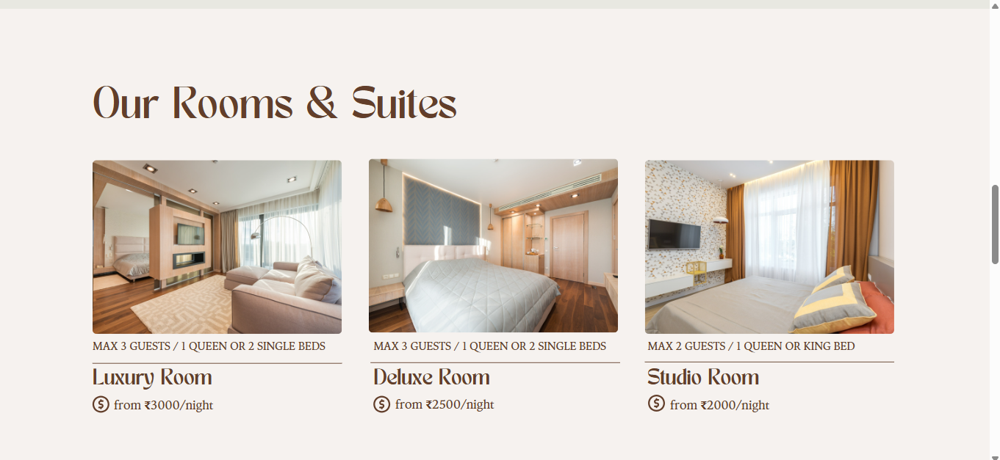
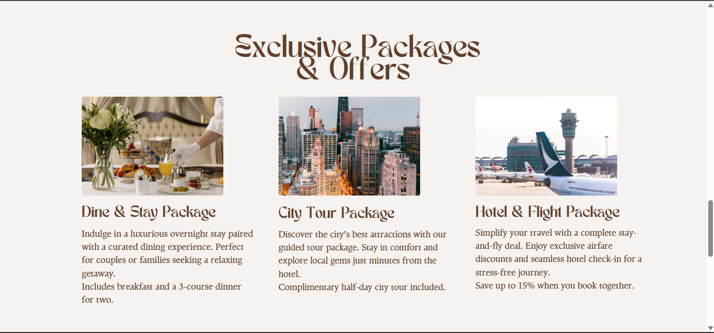
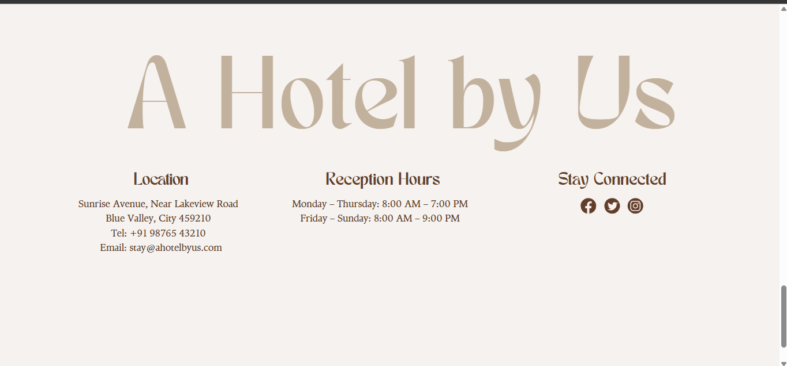

# 🏨 Day 65 – Hotel Website Design (5-Page Concept)

A complete **5-page hotel website design** created in **Canva**, inspired by a modern-elegance theme with warm cream and brown tones.  
This concept blends simplicity, luxury, and visual harmony — ideal for a premium hotel or resort website.

---

### 🌐 Live Design Preview  
🔗 [View Full Design Here](https://designsbychirag.my.canva.site/hotels-business-website-in-cream-light-brown-dark-brown-modern-elegance-style)

---

## 🖼️ Project Screenshots  

| **Home Page** | **About Page** |
|:--------------:|:---------------:|
|  |  |

| **Rooms Page** | **Gallery Page** |
|:---------------:|:----------------:|
|  |  |

| **Contact Page** |
|:----------------:|
|  |

> 🖼️ *Each screenshot represents one page from the full 5-page hotel website concept.*

---

## 🚀 Pages Designed
1. **Home Page** – Hero image, tagline, and call-to-action button.  
2. **About Page** – Brand story and visuals about the hotel’s heritage.  
3. **Rooms Page** – Room showcase cards with pricing and details.  
4. **Gallery Page** – Photo grid featuring ambiance and amenities.  
5. **Contact Page** – Form section with contact details and footer links.

---

## 🛠 Skills Used
- UI/UX Design Thinking  
- Multi-Page Website Planning  
- Visual Hierarchy & Layout  
- Color Palette and Typography Consistency  
- Branding & Aesthetic Composition  

---

## 🎨 Design Concept

The project was built around a **cream + brown + gold** palette to achieve a balance of **warmth and sophistication**.  
Typography pairing of *Playfair Display* (elegance) and *Montserrat* (modern simplicity) gives the design both class and clarity.

---

## 🧩 Future Scope
- Convert this Canva concept into a real **responsive HTML/CSS website**.  
- Add animations and transitions for interactive elements.  
- Optionally integrate Flask backend for form submissions and bookings.

---

## 🗒️ Design Documentation
See [`design_notes.txt`](design_notes.txt) for detailed notes on color palette, typography, and layout structure.

---

## 📅 Challenge
Day 65 of my **#100DaysOfPython** challenge — exploring the design side of development.  
Even though this day didn’t involve code, mastering design improves a developer’s sense of product quality.

---

### 🧑‍🎨 Tools Used
- **Canva (Desktop version)** – Design creation and layout  
- **GitHub** – Project presentation and documentation  

---

### 🐍 Challenge Info
This is part of my ongoing **#100DaysOfPython** journey — one project every day to improve my programming and creative thinking skills.  

📁 **Project Folder:** `Day65_HotelWebsiteDesign`  
