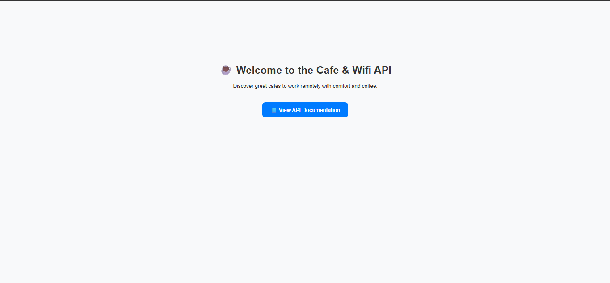
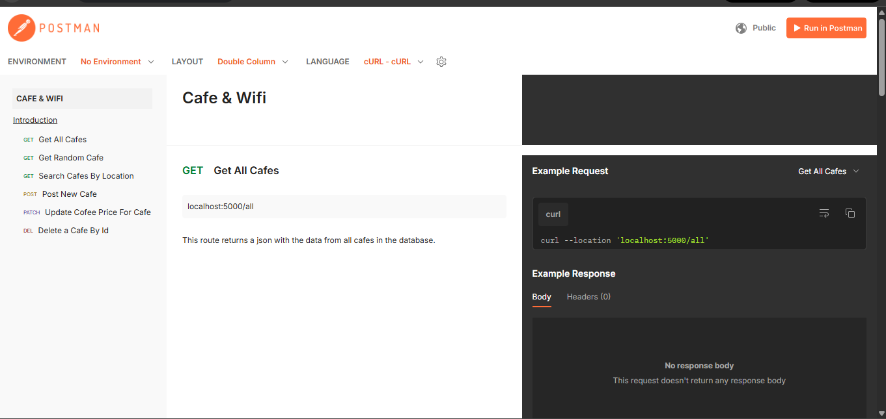
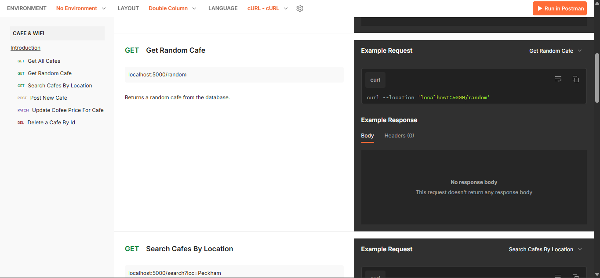
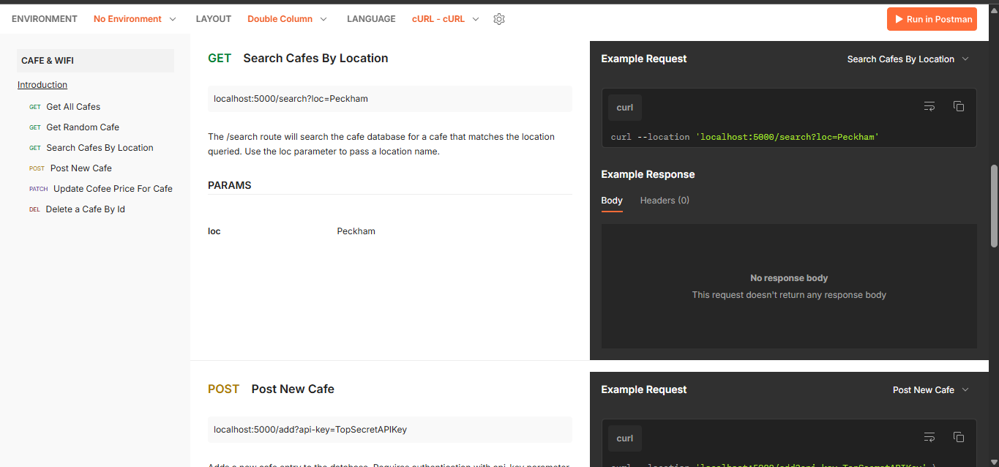
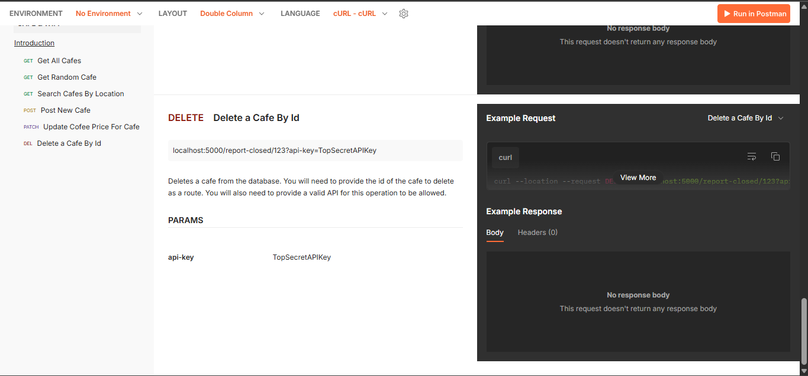

# ☕ Day 66 – Cafe & Wifi API

A Flask + SQLAlchemy REST API to find cafes ideal for remote work — complete with details like WiFi, sockets, and coffee prices.

---

## 🚀 How It Works
1. Run `python main.py` to start the Flask server.
2. The app launches at `http://127.0.0.1:5000/`.
3. Use your browser or Postman to test these routes:
   - `/random` → fetch a random cafe  
   - `/all` → get all cafes  
   - `/search?loc=City` → find cafes by location  
   - `/add` → add a new cafe (POST)  
   - `/update-price/<id>?new_price=₹X` → update cafe price (PATCH)  
   - `/report-closed/<id>?api-key=TopSecretAPIKey` → delete a cafe (DELETE)
4. All data is stored in `instance/cafes.db` using SQLite.

---

## 🛠 Skills Used
- Python  
- Flask  
- SQLAlchemy ORM  
- SQLite Database  
- Postman for API Testing  
- JSON Response Handling  

---

## 📸 Screenshots

### 🏠 Homepage

### 📜 GET /all – Fetch All Cafes

### 🎲 GET /random – Fetch Random Cafe

### 🔍 GET /search – Search by Location

### ❌ DELETE /report-closed – Delete Cafe by ID

---

## 📅 Challenge
Day 66 of the #100DaysOfPython challenge — built a full Flask REST API with CRUD functionality and JSON-based responses.  
Code in `Day66_Cafe_API` 📂  
🔗 GitHub: [https://github.com/chiragdhawan07/100-days-of-python]
