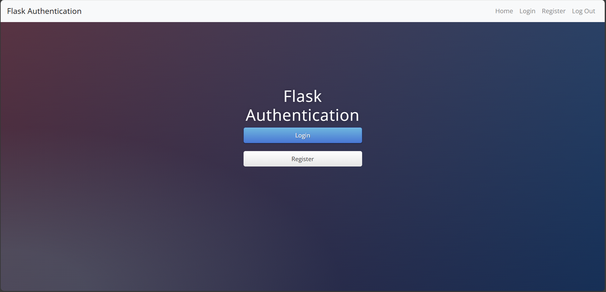
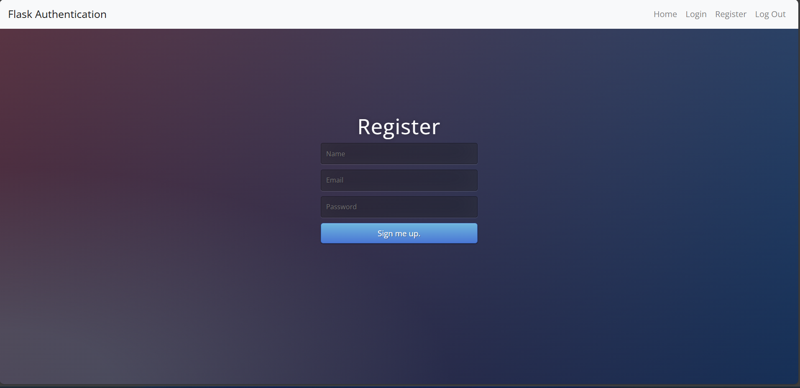
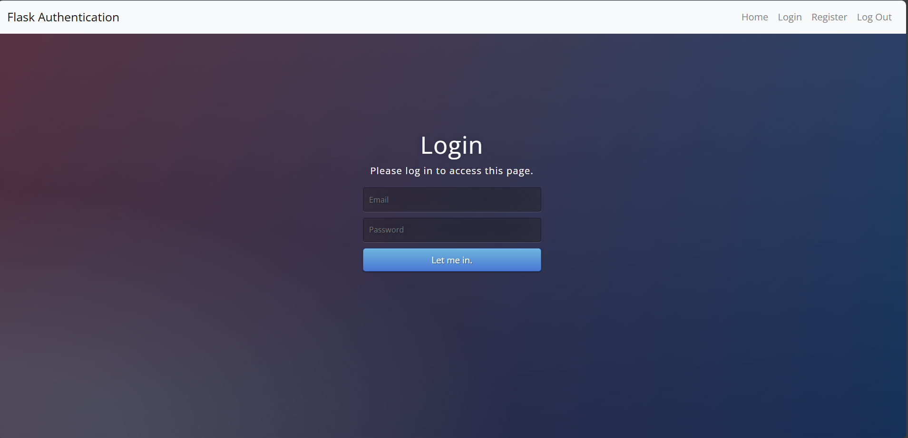
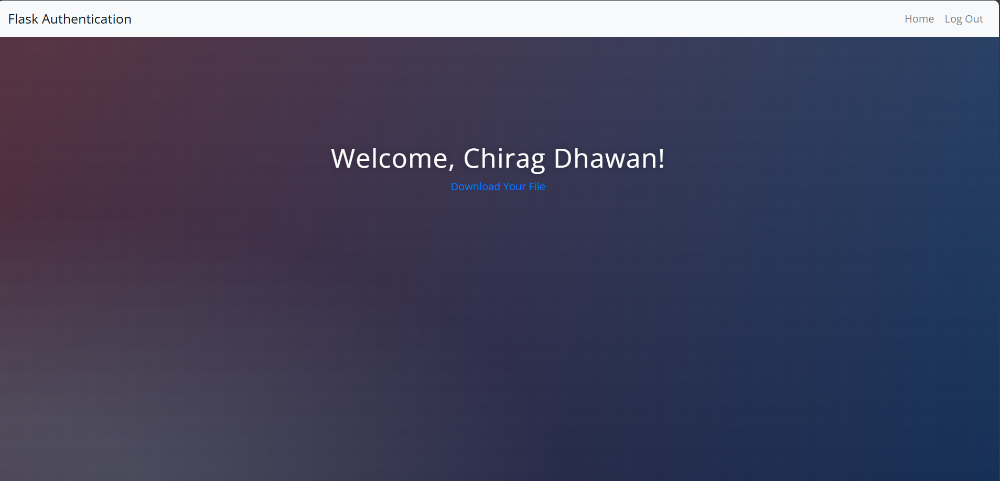

# 🔐 Day 67 – Flask Authentication System

A secure Flask web application that implements **user authentication** with login, registration, protected routes, and file downloads using Flask-Login and SQLAlchemy.

---

## 🚀 How It Works
1. Users can **register** with name, email, and password.
2. Passwords are **hashed securely** before storing in the database.
3. Registered users can **log in** using email and password.
4. Unauthorized users are redirected to the login page.
5. Logged-in users can access a **protected secrets page**.
6. Authenticated users can **download a protected file**.
7. Users can **log out** safely at any time.

---

## 🛠 Skills Used
- Flask
- Flask-Login
- SQLAlchemy ORM
- Password Hashing (Werkzeug)
- User Authentication & Authorization
- HTML (Jinja2 Templates)
- Bootstrap 5
- SQLite Database

---

## 📸 Screenshots

### 🏠 Home Page

### 📝 Register Page

### 🔑 Login Page

### 🔒 Secrets Page (Protected)

---

## 📅 Challenge
**Day 67 of the [#100DaysOfPython Challenge](https://github.com/chiragdhawan07/100-days-of-python)** 💯
