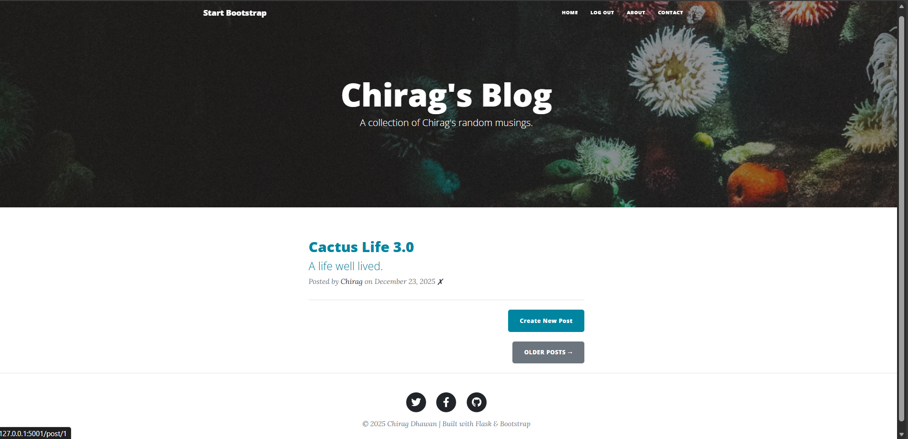
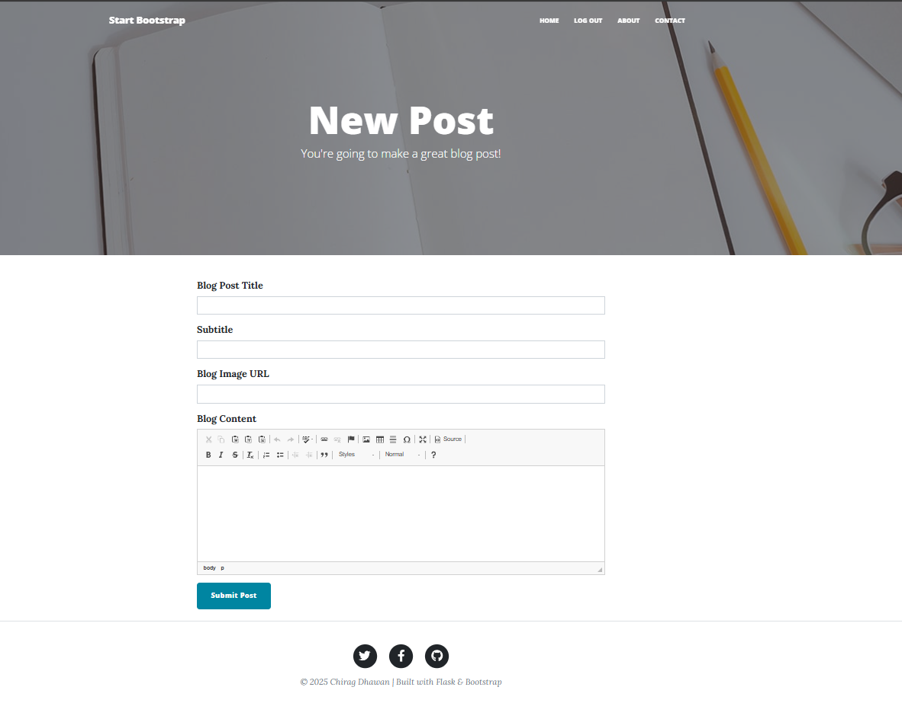
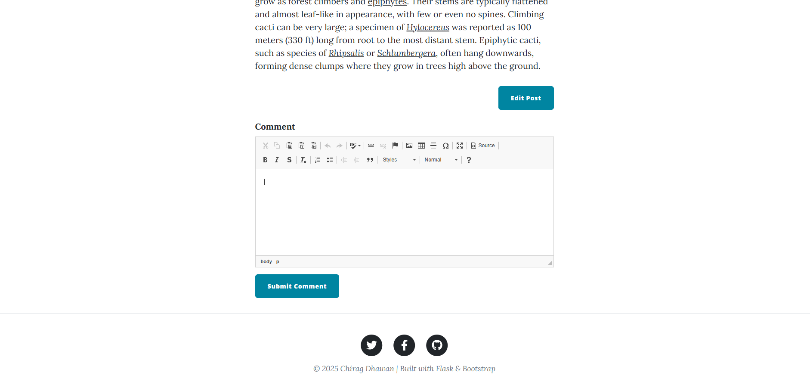
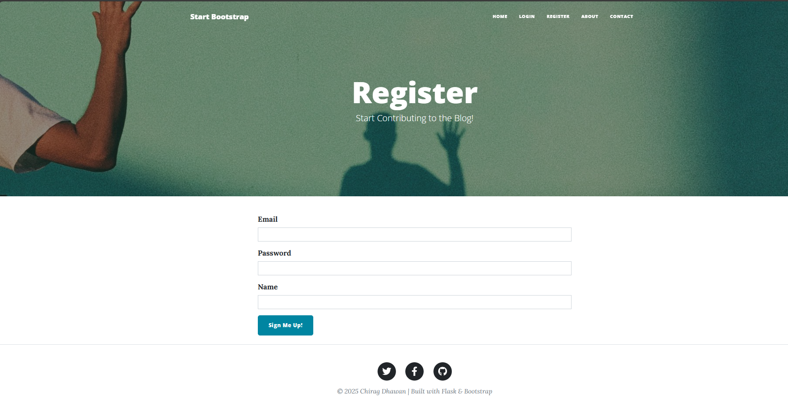
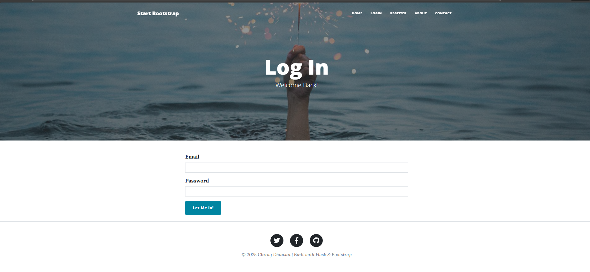
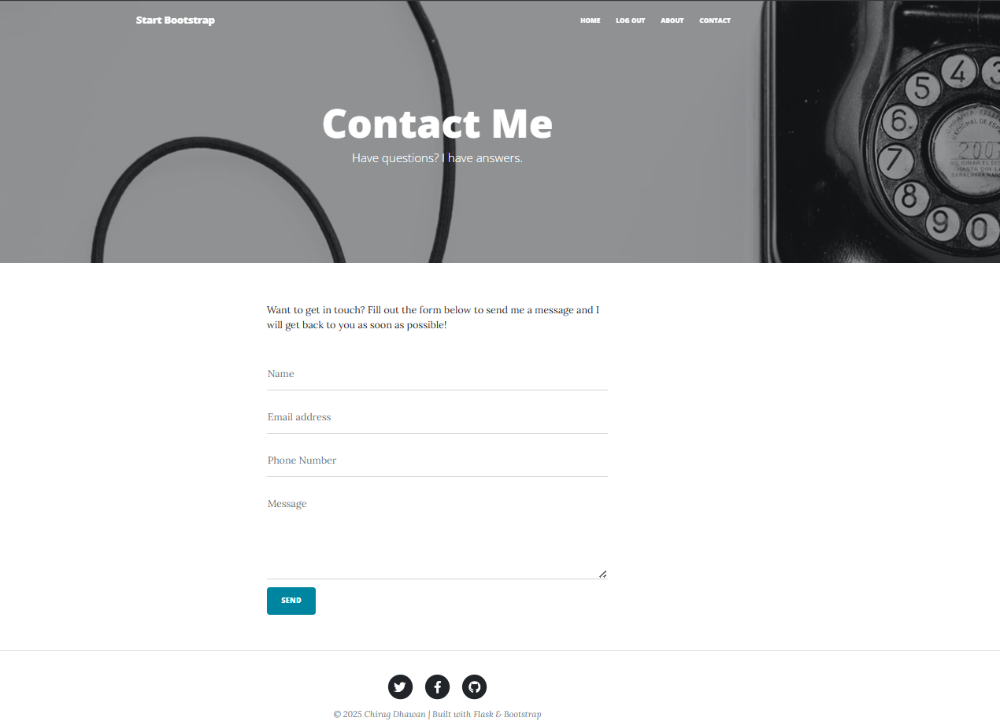
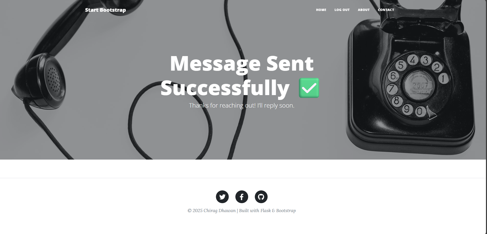
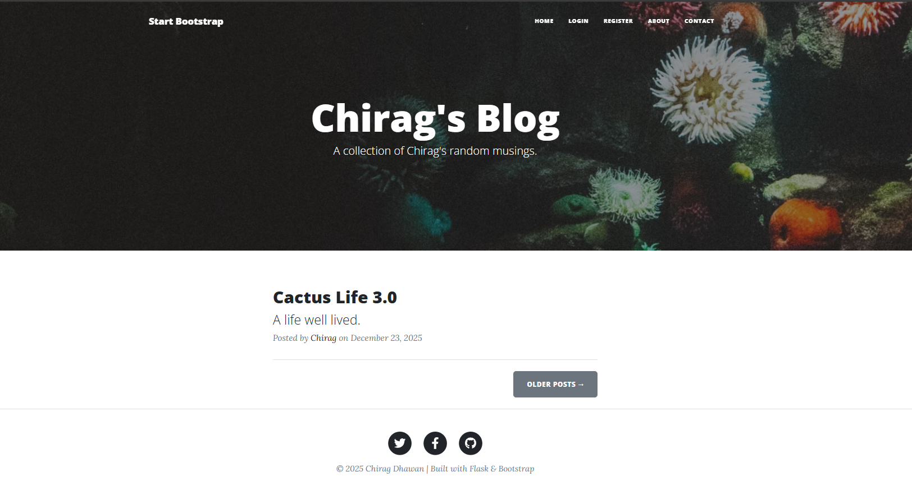

# 🌵 Flask Blog Website – Part 3 (Final Version)

A full-featured **Blog Content Management System (CMS)** built using **Flask**, featuring authentication, admin-only controls, rich text editing, comments, and a working contact form.

This is the **final version (Part 3)** of the Flask Blog project.

---

## 🚀 Features Overview

Screenshots are placed directly under each feature to clearly demonstrate functionality.

---

## 🧑‍💻 Admin Controls

- Admin-only access to:
  - Create new blog posts
  - Edit existing posts
  - Delete posts
- Admin is the **first registered user** (`user_id = 1`)
- Admin-only buttons are conditionally rendered in the UI

### 📸 Admin Dashboard


### 📸 Create New Post (Admin Only)


---

## 💬 Comment System

- Logged-in users can comment on posts
- Comments linked with users and blog posts
- Gravatar support for user avatars

### 📸 Comments Section


---

## 🔐 Authentication

- User Registration & Login
- Secure password hashing using **Werkzeug**
- Session handling using **Flask-Login**

### 📸 Register Page


### 📸 Login Page


---

## 📩 Contact Page

- Working contact form using POST request
- Success message after submission
- Secure credentials using environment variables

### 📸 Contact Form


### 📸 Contact Success Message


---

## 🎨 UI Pages

- Responsive UI using **Bootstrap 5**
- Reusable components (Header & Footer)
- Pages:
  - Home
  - Register
  - Login
  - Blog Post
  - Create/Edit Post
  - Contact
  - About

### 📸 Home Page


---

## 🛠️ Tech Stack

- Python
- Flask
- Flask-Bootstrap
- Flask-Login
- Flask-WTF
- Flask-CKEditor
- Flask-SQLAlchemy
- SQLite
- HTML, CSS, Bootstrap
- Jinja2

---

## ⚙️ Installation & Setup

# Clone the repository
```bash
git clone https://github.com/chiragdhawan07/100-days-of-python.git
cd 100-days-of-python/Day68-69_Flask-Blog-Website-v3
```

# Create virtual environment
```bash
python -m venv .venv
```
# Activate virtual environment (Windows)
```bash
.venv\Scripts\activate
```

# Activate virtual environment 
(Mac/Linux)
```bash
source .venv/bin/activate
```

(Windows)
```bash
.venv\Scripts\activate
```

# Install dependencies
```bash
pip install -r requirements.txt
```

---

## 🔐 Environment Variables

Create a `.env` file (DO NOT upload to GitHub):
```bash
OWN_EMAIL=your_email@gmail.com  
OWN_PASSWORD=your_app_password
```

---

## ▶️ Run Application
```bash
python main.py
```

Open browser:
http://127.0.0.1:5001

---

## 🧠 What I Learned

- Flask project structuring
- Authentication & authorization
- Database relationships
- Admin-only route protection
- Secure password handling
- Working with forms & POST requests
- Environment variable security
- Full-stack Flask development

---

## 📌 Project Status

✅ Completed  
✅ Final Version (Part 3)  
✅ Portfolio Ready  

---

## 👤 Author

**Chirag Dhawan**  
Built with ❤️ using Flask & Bootstrap
